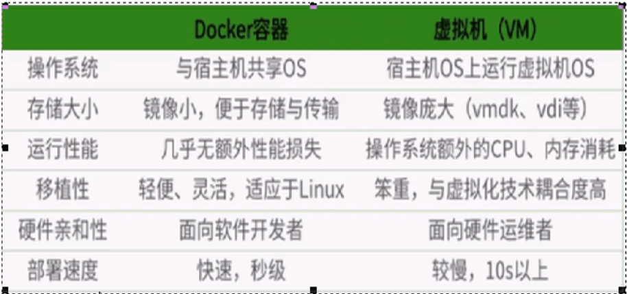

## 一、docker简介

#### 1、为什么出现

	由于开发和部署的环境配置不同，所以在部署的时候需要将原始环境一模一样复制过来。（避免开发机器可运行，部署不能运行，==搬家直接搬楼==）

#### 2、是什么

	基于GO语言实现的云开源框架
	
	Docker目标：一次封装，处处运行。
	
	只要开发自己配置好环境，换到别的机子上就可以一键部署好，简化操作

==解决了运行环境和配置问题软件容器，方便做持续集成并有助于整体发布的容器虚拟化技术==

#### 3、能干嘛

虚拟机：

	1、缺点：资源占用多，冗余步骤多，启动慢

Docker：Linux容器（LXC）

	1、传统虚拟机虚拟出一套硬件，在其上运行一个完整的操作系统，而容器内的应用进程直接运行于宿主机内核，容器没有内核，而且也没有进行硬件配置。比传统更轻便
	
	2、容器间互相隔离，有自己的文件系统，进程间不会互相影响，耦合度较低

> 中文网站：www.docker-cn.com
>
> 仓库：dockerhub存储镜像

## 二、Docker安装

#### 1、查看版本

>uname -r
>
>cat /etc/redhat-release

#### 2、Docker基本组成

##### 	1、镜像

		类比Java类，就是一个只读模板，用来创建Docker容器，一个镜像可以创建多个容器

##### 	2、容器

		类比Java对象，利用镜像创建的运行实例，==简易版的Linux环境==。容器的定义和镜像几乎一模一样，也是一堆层的统一视角，唯一区别在于容器的最上面那已成是可读可写的

##### 	3、仓库

存放镜像文件的场所。仓库和仓库注册服务器有区别。仓库注册服务器上往往放着多个仓库，每个仓库有多个镜像，每个镜像有不同标签

##### 	4、总结

	Docker本身就是一个管理引擎，或容器运行载体

##### 	5、版本

	社区（免费），企业（收费）

#### 3、安装

##### 1、CentOS6.8

		>yum install -y epel-release确保已持有epel库
		>
		>yum install -y docker.io
		>
		>/etc/sysconfig/docker

##### 2、CentOS7

>卸载olderDocker 
>
>vim /etc/docker/daemon.json
>
>systemctl daemon-reload
>
>systemctl restart docker

```she
//https://docs.docker.com/install/linux/docker-ce/centos/#os-requirements
yum -y install gcc
yum -y install gcc-c++
gcc -v
sudo yum remove docker \
                  docker-client \
                  docker-client-latest \
                  docker-common \
                  docker-latest \
                  docker-latest-logrotate \
                  docker-logrotate \
                  docker-selinux \
                  docker-engine-selinux \
                  docker-engine
sudo yum install -y yum-utils \
  device-mapper-persistent-data \
  lvm2
sudo yum-config-manager --add-repo https://download.docker.com/linux/centos/docker-ce.repo//不建议，防火墙出现超时连接
sudo yum-config-manager --add-repo https://mirrors.aliyun.com/docker-ce/linux/centos/docker-ce.repo
yum makecache fast
yum -y install docker-ce//安装
systemctl docker start
//配置镜像加速
vim /etc/docker/daemon.json
systemctl daemon-reload
systemctl restart docker

卸载
systemctl stop docker
yum -y remove docker-ce
rm -rf /var/lib/docker

```


#### 4、helloword和云加速

##### 1、阿里云镜像加速

- 登陆阿里云获取加速地址，操作配置文件
- service docker restart

#### 5、运行原理

- C-S结构，Docker守护进程运行在主机上，然后通过Socket练级从客户端访问，守护进程接受命令并管理运行容器
- 为什么比VM更快：docker有更少的抽象层，虚拟机（软件加硬件完整的操作系统）运用hypervisor实现硬件资源虚拟化。docker直接使用实际物理资源。因此在CPU，内存利用率上docker效率更高；2docker利用宿主机内核，不需要虚拟的操作系统避免费事耗资源



### 三、常用命令

#### 1、帮助命令

```shell
docker info
docker version
docker --help
```

#### 2、镜像命令

##### a)docker images

1、repository:表示镜像的仓库源、tag:镜像的而标签、imageId:镜像的ID、created:镜像创建时间、size:镜像的大小

2、options

	-a：列出本地所有镜像，包含中间映像层
	
	-q：只显示镜像ID
	
	--digests：显示镜像的摘要信息
	
	--no-trunc：显示完整的镜像信息

##### b)docker search

-s star

##### c)docker pull

##### d)docker rmi

##### e)docker交互命令

	--name：=指定一个名称
	
	-d：后台运行容器，返回容器ID，也即启动守护式容器；
	
	-i：以交互模式云心容器
	
	-t：为容器重新分配一个伪输入终端
	
	-P：随机端口映射
	
	-p：端口

##### f)docker ps

	-a：列出当前所有正在运行的容器，历史运行过的
	
	-l：显示最近创建的容器
	
	-n：显示最近n个创建的容器
	
	-q：静默模式，只显示容器编号
	
	--no-trunc：不截断输出

##### g)退出容器

	exit-容器停止退出
	
	ctrl+p+Q容器不停止退出
	
	docker stop 温柔
	
	docker kill强制

##### h)一次性删除多个容器

	docker rm -f ${docker ps -a -q}
	
	docker ps -a -q | xargs docker rm

#### 3、常用命令

##### a)docker run -d centos

后台运行，必须有前台进程，如果不是一直挂起的命令，就会自动退出 

##### b）docker -logs

 -f（最新的日志打印） -t（加入时间戳） --tail（最后多少条） 容器ID

##### c）查看容器内的进程

docker top 容器ID

##### d）查看容器内细节

docker inspect 容器ID

##### e）容器交互

attach 容器ID（直接进入容器启动命令终端，不会启动新的进程）

exec -t 容器ID 交互命令（再容器中打开新的终端，并且可以启动新的进程）


### 四、Docker镜像

#### 1、是什么

##### a）联合文件系统是

一种分层，轻量级高新能的文件系统，他支持对文件系统的修改作为一层层的叠加。

##### b）镜像加载原理

bootfs：bootloader和kernel（linux内核，最底层）

rootfs：只需要包括最基本的命令，工具和程序库就可以了，因为地城直接用宿主机的kernel，自己只需要提供rootfs就行了。

##### c）分层的镜像

##### d）为什么采用分层

共享资源，


#### 2、特点

都是只读。

容器启动时，一个新的可写层被加载到镜像顶部。这一程称为容器层，容器之下叫做镜像层

#### 3、commit操作

-P随机分配端口

docker commit -a=“作者” -m="注释" 容器ID 容器名：版本号

### 五、容器数据卷

#### 1、持久化和数据共享

#### 2、容器数据卷添加

a）直接命令

a）直接命令

a）直接命令


##### a）直接命令--达到数据共享的目的

docker -it centos --name mycentos -v /宿主机目录:/容器内目录

docker run -it -v /宿主机目录：/容器内目录：ro(read only)

##### b）DockerFile

DockerFile镜像的描述

```doc
FROM centos:lastet
VOLUME ["/dataVolume1", "/dataVolume2"]//容器内创建目录，会自动关联到宿主机目录
CMD echo “finshed,-----success1”
CMD /bin/bash
docker build
```


##### c）备注

#### 3、数据卷容器

##### a）是什么

命名的容器挂载数据卷，其他容器通过挂载这个（父容器）实现数据共享，挂载数据卷的容器，称之为数据卷容器

##### b）总体介绍

##### c）容器卷传递共享

--volumes-from 容器名称 实现数据传递共享

==容器之间配置信息的传递，容器卷的生命周期一直持续到没有容器使用它为止==

### 六、Dockerfile解析

#### 1、是什么

构建Docker镜像的构建脚本，是有一系列命令和参数构成的脚本

编写步骤1、编写Dockerfile文件2、docker build3、docker run

```docker
//centos
FROM scratch//object原镜像
MAINTAINER The CentOS Project <cloud-ops@centos.org>//作者
ADD c68-docker.tar.xz /
LABEL name="CentOS Base Image" \
    vendor="CentOS" \
    license="GPLv2" \
    build-date="2016-06-02"//说明

# Default command
CMD ["/bin/bash"]
```


#### 2、构建过程

##### a）基础内容

- 每条指令必须大写，字母后必须跟随一个参数
- 指令从上到下顺序执行
- #标识注释
- 每条指令都会创建一个新的镜像层，并对镜像进行提交

##### b）执行Dockerfile大致流程

	1、基础镜像运行一个容器

	2、执行一条指令并对容器做出修改

	3、执行类似docker commit操作提交一个新的镜像层

	4、docker再基于刚提交的镜像运行一个新容器

	5、执行dockerfile中的下一条指令知道所有指令都执行完成

1、Dockerfile：需要定义一个Dockerfile，Dockerfile定义了进程需要的一切东西。Dockerfile涉及执行代码或文件，环境变量，依赖包，运行时环境，动态链接库，操作系统的发行版本，服务进程和内核进程（当应用进程需要和系统服务和内核进程打交道，这时需要考虑如何设计namespace的权限设计）

2、Docker镜像

3、Docker容器

##### c）保留字指令

```dockerfile
FROM :基础镜像
MAINTAINER :镜像维护者姓名邮箱
RUN :容器构建时需要运行的指令
//RUN groupadd -r redis && useradd -r -g redis redis
EXPOSE :容器对外暴露端口号
WORKDIR :指定再创建容器后，终端默认登陆的进来的工作目录，一个落脚点
ENV :构建过程中环境变量
ADD :拷贝文件+解压缩和处理URL
COPY :只是复制
//COPY src dest  COPY ["src", "dest"]
VOLUME :保存数据和持久化工作
CMD :指定容器启动时要运行的命令，可以有多个CMD但只有最后一个生效，CMD会被RUN之后的参替换
ENTRYPOINT :
ONBUILD :构建一个被继承的dockerfile时运行命令，父镜像再被子继承后父镜像的onbuild被触发

```

##### d）案例

1、修改centos，支持vim，ifconfig

```dockerfile
	FROM centos
	ENV MYPATH /usr/local
	WORKDIR $MYPATH
	
	RUN yum -y install vim
	RUN yum -y install net-tools
	EXPOSE 80
	
	CMD echo $MYPATH
	CMD echo "success-----ok"
	CMD /bin/bash
	
	
	docker build -f /dockerfile -t 新镜像的名字:tag .
```

2、体现CMD和ENTRYPOINT

CMD会被docker run 之后的参数替换（如果run之后加了shell命令，就不会运行dockerfile默认的执行命令，指挥执行run后加的shell 命令）

ENTRYPOINT 不会被替换，会被追加

3、tomcat9

--privileged=true//权限问题

docker exec 容器ID ls -l

4、redis持久化

--appendonly yes

