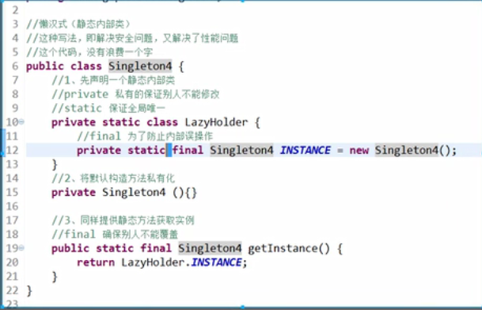
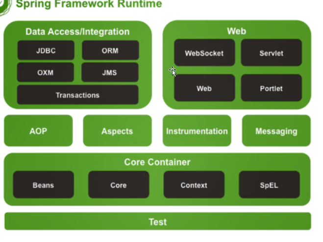

# 一、概念

1、AOP的核心是定义规则--解耦

2、控制反转

3、IOC容器（JavaBean 的容器）

4、依赖注入（赋值）

5、Spring核心宗旨--简化开发

# 二、

## 1、AOP应用场景

权限认证、日志、事务、懒加载、ContextProcess上下文处理

ErrorHandler（异常捕获机制-错误追踪）、缓存处理

## 2、常用设计模式

### 代理模式——字节码重组

#### JDK动态代理：

实现InvacationHandler——字节码重组

```java
public class ManInvocation implements InvocationHandler {

    private Person person;
    public Object getInstance(Person target){
        this.person = target;
        Class clazz = target.getClass();
        return Proxy.newProxyInstance(clazz.getClassLoader(), clazz.getInterfaces(), this);
    }
    @Override
    public Object invoke(Object proxy, Method method, Object[] args) throws Throwable {
        method.invoke(this.person, args);
        return null;
    }
}

//生成源码
//编译class
//加载class至JVM
```

#### Cglib动态代理：（事务）

实现MethodIntercept

动态代理是通过生成一个呗代理对象的子类，然后重写父类的方法生成的对象，可以强制转换为被代理对象

CGlib new出来的对象是被代理对象的子类，new子类，必须 super，间接持有了父类的引用

### 工厂模式

#### 简单工厂

#### 工厂方法

#### 抽象工厂

### 单例模式



```java
public class C1{
    private static class C2{
        private static final NEW_INSTANCE = new C1();
    }
    private C1(){}
    public static C1 getInstance(){
        return C2.NEW_INSTANCE;
    }
}
```

> 类装载顺序
>
> 1、从上到下
>
> 2、先属性后方法
>
> 3、先静态后动态

### 委派模式

IOC有个Register（为了告诉我们的容器，在这个类初始化的过程中，做很多不同逻辑处理， 不同任务执行者，实现各自的功能）

保证结果一致性。保证结果的多样性。只有一种方法

### 策略模式

### 原型模式

克隆接口：只能拷贝9种，8大数据类型+String（不能拷贝 List）拷贝基于字节码，拷贝不走构造方法


# 三、总结

### 1、编程思想

1、AOP：解耦，专人做专事

2、OOP：封装、继承、多态

3、BOP：一切从Bean开始

4、IOC：转交控制权

5、DI/DL：先理清再赋值

### 2、设计模式

1、代理模式：办事要求人，所以找代理

2、工厂模式：只对结果负责，不要三无产品

3、单例模式：保证独一无二，解决功能性冲突

4、委派模式：干活是你，功劳是我

5、策略模式：达到目的就行

6、原型模式：有一个原型，数据相同，实例不同

7、模板模式：路程标准化，原料自己加

# 三、Spring架构




