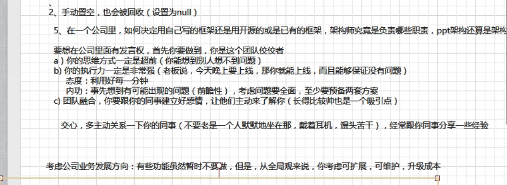

## 入口

1、spring-bean：getBean

2、spring-aop：getProxy

3、spring-mvc：DispatcherServlet

> DispatcherServlet 产生的历程  单机-》Web->Servlet->Struct-》SpringMVC

### 4、DispatcherServlet实现Aware接口

1、doService参数

2、刷新容器 onRefresh()

### 5、HandlerMapping

### 6、Controller

## Spring和Struts 框架比较

 ValueStack

4、Spring启动：1、Lisenter，2、手动启动，3、插件形式启动

5、filter 有链的内容，servlet只调用

缺点：

## 问题

#### 1、AOP动态代理实现方式：

JDKProxy和Cglib

#### 2、Spring的父子容器：

必须实现BeanFactory，IOC容器，AOP容器，MVC容器（扩展关系）

#### 3、实现哪些实现单例

#### 4、SpringBean垃圾回收

#### 5、分布式事务原理

##### 单机事务

1、设置数据源

2、transactionManager事务管理器

提交数据能回滚数据

##### 分布式事务（事务管理器有一个， 数据源多个）

解决：动态切换数据源，达到回滚目的

1、数据库1（订单系统）数据库2（银行系统） 数据库3（用户系统）

2、订单生成-支付-赠送积分

3、一致性（瞬时一致性，最终一致性）

4、每一步提交都是异步，然后把操作的内容写入到日志中，一旦发现某一步发生错误，通过分析日志文件能够将数据回滚

#### 6、考虑的问题

