# 哈希表

## 一、介绍

跟模具关键码值而直接进行访问的数据结构， 也就是说，他通过把关键码值而直接进行访问的数据结构。

数组+ 链表；

数组+ 二叉树

# 树结构

## 一、介绍

当前存储方式

### 1、数组

优点：用下表访问会很快

缺点：如果新增数据， 需要扩容存储

### 2、链式存储

优点：插入数据和删除数据方便

缺点：检索时新能低

### 3、树存储

提高了数据存储和读取的效率， 例如利用二叉排序树，可以保证数据的检索速度，同时也可以保证数据的插入，删除，修改速度

### 4、二叉树

树的每个节点最多只有两个子节点的树

满二叉树，完全二叉树

#### 遍历

##### a）前序遍历

先输出父节点，在遍历左子树右子树

##### b）中序遍历

先便利左子树，再输出父节点，再遍历右子树

##### c）后续遍历

先遍历左子树，再遍历右子树，最后输出父节点

#### 查找

1、前序查找

2、中序查找

3、后续查找

#### 删除节点

### 5、顺序存储二叉树

#### 1、介绍

从数据存储来看， 数组存储方式和树的存储方式可以相互转换， 及数组可以转换成树。

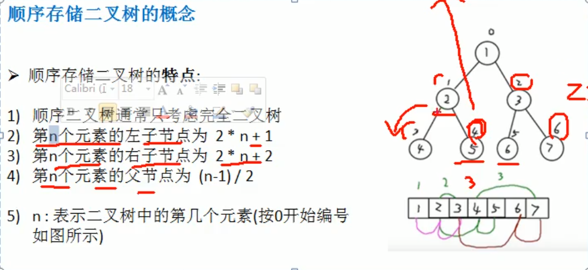

```java
//前序遍历
public void preOrder(int index){
    sout(arr[index]);
    if(2* index + 1 <= arr.length){
        preOrder(2* index + 1);
    }
    if(2 * index + 2 <= arr.length){
        preOrder(2* index + 2);
    }
}
```

### 6、线索化二叉树

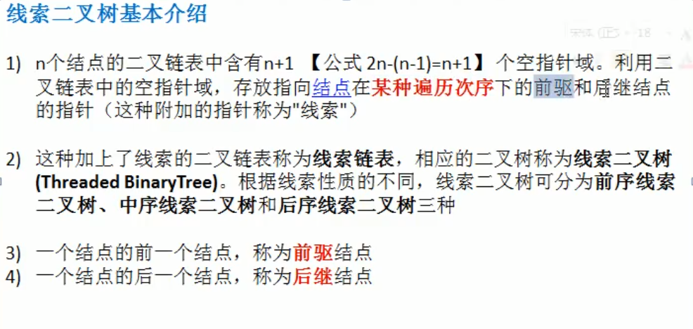

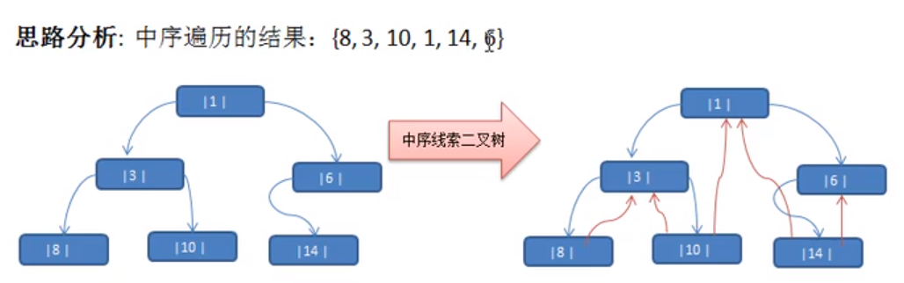

#### 1、代码实现

```java
public void threaded(Node node){
    
    //处理左子树
    
    if(node.left == null ){
        node.setLeft(pre);
        node.setLeftType(1);
    }
    if(pre != null && pre.right == null){
        pre.setRight(node);
        pre.setRightType(1);
    }
    //!!!!!!!!!!!
    pre = node;
    
    //处理右子树
}
```

#### 2、遍历线索化树

```java
public void list(){
    Node node = root;
    while(node != null){
        while(root.getLeftType() == 0 ){
            node = node.left;
        }
        
        sout(node);
        while(node.getRightType == 1){
            node = node.right;
            sout(node);
        }
        node = node.right;
    }
}
```

### 7、大顶堆小顶堆

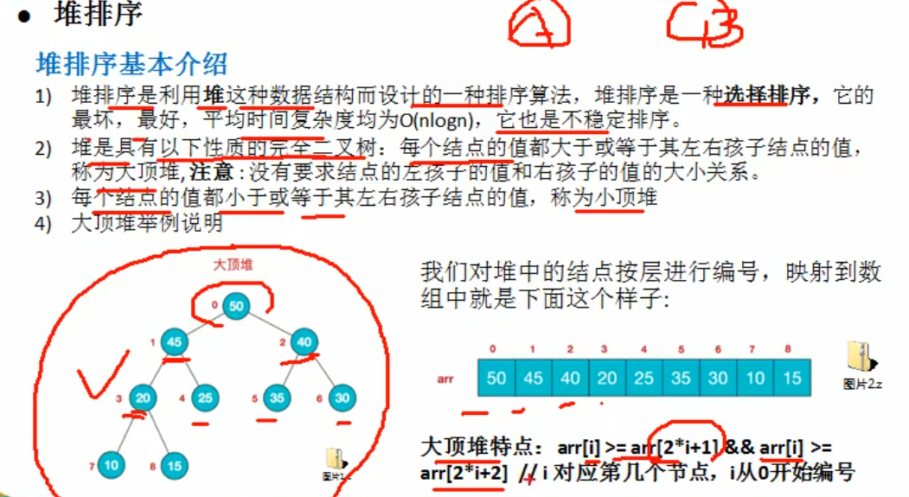

### 8、堆排序

#### 1、介绍

1、将待排序队列构造成一个大顶堆

2、此时，整个序列的最大值就是对顶的根节点

3、将堆顶元素和末尾元素进行交换

2，3

```java
//数组存储树的时候，最后一个非叶子节点是arr.length/2 - 1
```

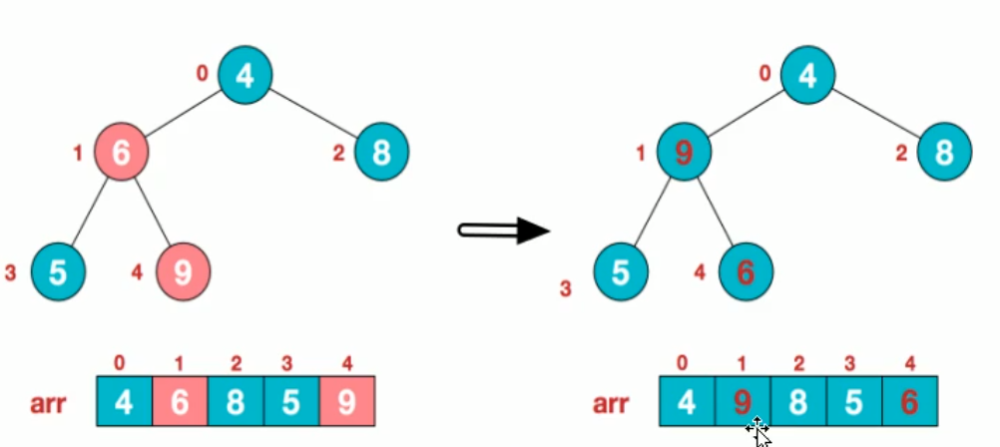

#### 2、代码实现

```java
public static void adjustHea0p(int[] arr, int i, int lenght){
    int temp = arr[i];
    for(int k = i* 2 + 1; k < length; k = K * 2 + 1){
        if(k+1 < length && arr[k] < ar[k+1]){
            k++;
        }
        if(arr[k] > temp){
            arr[i] = arr[k];//赋值给当前节点
            i = k;//i指向k，继续循环比较
        }else{
            break;
        }
    }
    arr[i] = temp;
}
public static void heapSort(int arr[]){
    //构建大顶堆
    for(int i= arr.length/ 1 -1 ; i>=0;i++){
        adjustHeap(arr, i, arr.length);
    }
   
    //将堆顶元素与末尾交换，沉底
    for(int j = arr.length -1; j>0;j--){
        temp = arr[j];
        arr[j] = arr[0];
        arr[0] = temp;
        adjustHeap(arr, 0, j);
    }
   
}
```

### 9、哈夫曼树

#### 1、介绍

给定n个权值作为n个叶子节点，构造一棵二叉树，若该树的带权路径长度达到最小，则成这样的树为最尤二叉树，也成为哈夫曼树

#### 2、构建过程

1、排序原数组

2、选取最小的值作为左右节点构成二叉树，然后将根节点的权值，添加到原数组中

3、重复1，2步骤，知道数组中只剩一个值为止

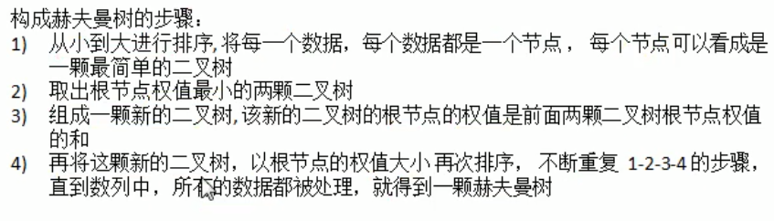

#### 3、哈夫曼编码

##### 1、介绍（属于浅前缀编码）

1、属于程序算法

2、通信中的应用

3、用于数据压缩，压缩率在0.2-0.9之间（对于定长编码而言）

4、由于数据可能会相同， 所以排序不同时，编码可能完全不一样

##### 2、构建过程

1、将数据出现的次数构建一颗哈夫曼树

2、进行编码， 左为0右为1，进行编码

##### 3、最佳实践

文件压缩。

```java
//压缩时， 注意1、最后一个8位不够的问题 
Integer.parseInt(value, 进制);

/**
解压时，注意
1、int负数转二进制时的低位截取问题，
2、int正数转二进制时的补齐问题   temp |= 256 可解决
3、最后一位不需要补齐的问题
*/
```


##### 4、注意事项

1、如果对已经进行过压缩的文件，压缩效果不明显， 例如视频，ppt等文件

2、哈夫曼压缩是按照字节进行压缩的， 可以压缩任何文件

3、如果重复数据不多，则压缩效果不明显

### 10、二叉排序树（BST）

#### 1、删除节点的三种情况

##### 第一种、删除叶子节点

找到要删除的节点targetNode

找到targetNode的父节点parent

确定targetNode是parent的左子节点还是右子节点

##### 第二种、删除又一个子树的节点

找到要删除的节点targetNode

找到targetNode的父节点parent

确定target的子节点是左子节点还是右子节点

targetNode是parent的左子节点还是右子节点

parent.left = targetNode.left

parent.left=targetNode.right

parent.right= targetNode.left

parent.right=targetNode.right

##### 第三种、删除有两个子树的节点

找到要删除的节点targetNode

找到targetNode的父节点parent

找到子树（整个树当中）找到的最小值，给到要删除的位置

#### 2、代码实现删除节点

```java
//查找值得节点信息
public Node search(int value) {
    if (this.value == value) {
        return this;
    } else if (this.value > value && this.left != null) {
        if (this.left == null) {
            return null;
        }
        return this.left.search(value);
    } else {
        if (this.right == null) {
            return null;
        }
        return this.right.search(value);
    }
}
//查找父节点
public Node searchParent(int value) {
    if ((this.left != null && this.left.value == value)
        || (this.right != null && this.right.value == value)) {
        return this;
    } else if (value < this.value && this.left != null) {
        return this.left.searchParent(value);
    } else if (value >= this.value && this.right != null) {
        return this.right.searchParent(value);
    } else {
        return null;
    }
}
//删除右子树的最小值
public int deleteMinValue(Node node){
    Node temp = node;
    while(temp.left != null){
        temp = temp.left;
    }

    deleteNode(temp.value);

    return temp.value;

}
//删除节点信息
public void deleteNode(int value) {
    if (root == null) {
        return;
    } else {
        Node targetNode = searchNode(value);

        if (targetNode == null) {
            return;
        }

        if (root.left == null && root.right == null) {
            root = null;
        }
        Node parentNode = searchParent(value);

        if (targetNode.left == null && targetNode.right == null) {
            if (parentNode.left != null && parentNode.left.value == value) {
                parentNode.left = null;
            } else {
                parentNode.right = null;
            }
        } else if (targetNode.left != null && targetNode.right != null) {
            int minValue = deleteMinValue(targetNode.right);
            targetNode.value = minValue;
        } else {
            if (targetNode.left != null) {
                if (parentNode.left != null && parentNode.left.value == value) {
                    parentNode.left = targetNode.left;
                } else {
                    parentNode.right = targetNode.left;
                }
            } else {
                if (parentNode.left != null && parentNode.left.value == value) {
                    parentNode.left = targetNode.right;
                } else {
                    parentNode.right = targetNode.right;
                }
            }
        }

    }
}
```

### 11、平衡二叉树

#### 1、问题

二叉排序树可能会造成，左子树全部为空。平衡二叉树是对二叉排序树得优化

#### 2、介绍

1、平衡二叉树又称 AVL树，可保证查询效率较高

2、特点：左右两个子树得高度差不超过1， 并且左右两个子树也是平衡二叉树

3、常用实现方法：红黑树，AVL，替罪羊树，treap，伸展树

#### 3、左旋转（单旋转）

```java
//在添加时使用

//新建一个节点，值为当前节点值
Node node = new Node(value);
//新节点得左子树=当前节点得左子树
node.left = left;
//新节点得右子树=当前节点右子树得左子树
node.right = right.left;
//当前值=当前节点右子树得值
value = right.value;
//当前节点左子树=新节点
right = right.right;
//当前节点右子树=当前节点右子树得右子树
left = node;
```

#### 4、右旋转

```java
//新建节点，值为当前根节点值
Node node = new Node(value);
//新建节点左节点=当前节点左节点
node.right = right;
//新建节点右节点=当前节点左节点得右节点
node.left=left.right;
//当前节点得值改为左节点得值
value = left.value;
//当前节点得左节点=左节点得左节点
left = left.left;
//右节点=新节点
right = node;
```

#### 5、双旋转

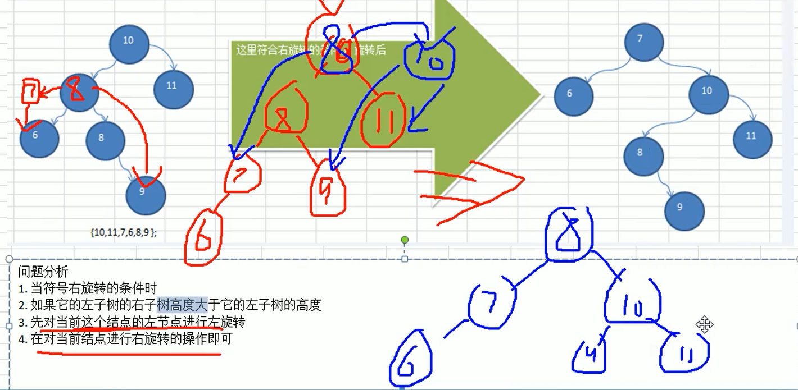

```java
//由于右旋转时， 左子树得  右子树高度大于左子树的高度
//需要先对左子树进行左旋转， 然后再对当前节点进行右旋转即可
```

### 12、多路查找树

#### 1、问题

1、二叉树如果节点少， 没什么问题， 如果二叉树节点树很多就存在如下问题：

2、构建二叉树，存在IO操作，速度有影响

3、二叉树高度很高，会降低操作速度

#### 2、介绍

1、多叉树

如果允许某个节点可以存储多个数据项和更多的子节点，就是多查出

2、2-3树

3、B树

降低了树的高度，文件系统及数据库设计

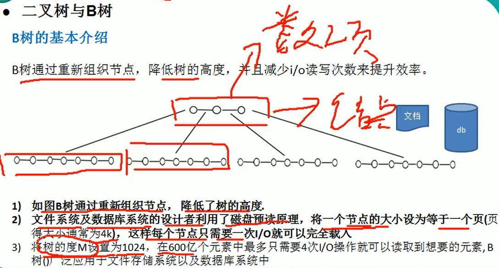

#### 3、好处

通过重新组织节点，减少树的高度，能对二叉树进行优化

### 13、二三树

#### 1、介绍

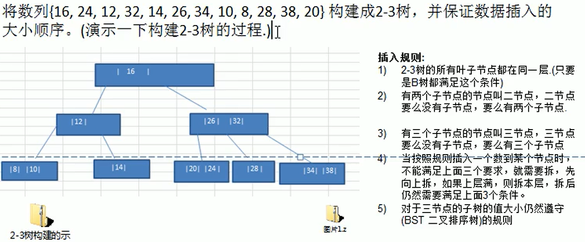

1、叶子节点都在一层

2、有两个节点的节点叫做二节点，二节点要么没有子节点，要么有两个子节点

3、有三个节点的节点叫做三节点，三节点要么没有子节点，要么有三个子节点

#### 2、图解

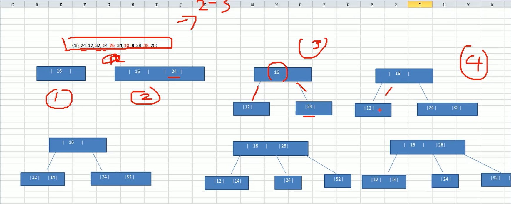

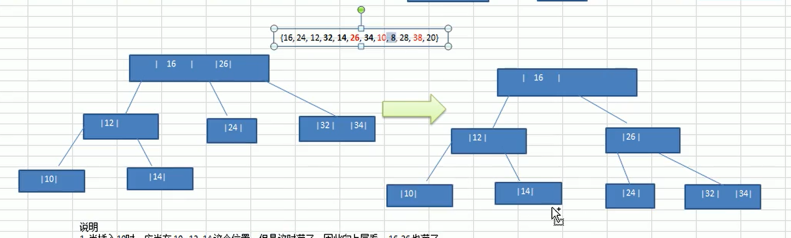

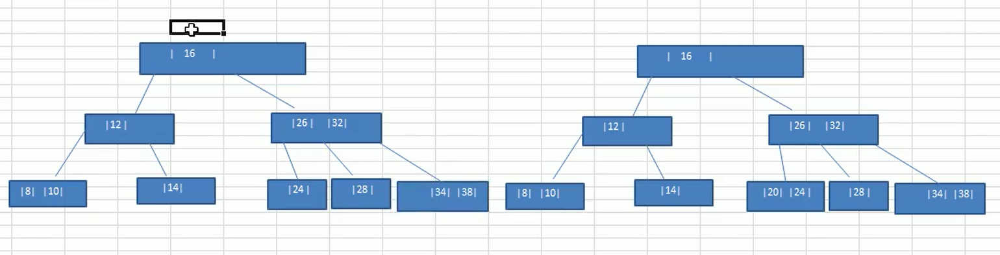

### 14、B树、B+树、B*树

#### 1、介绍

平衡树，排序树， B-树就是 B树(没有B减树)

2-3树，2-3-4树就是B树

#### 2、B树

B树的性能等价于在关键字全集做一次二分查找

#### 3、B+树

与B树的区别， 数据都会存放在叶子节点

非叶子节点相当于叶子节点的索引

更适合文件索引系统

#### 4、B*树

对B+树进行变种

在B+树的非根和非叶子节点的节点在增加指向兄弟的指针

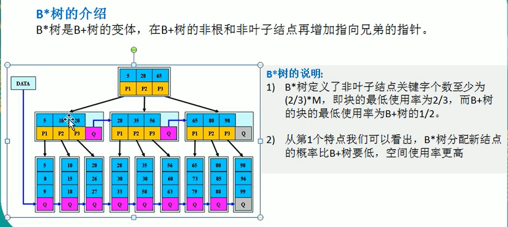