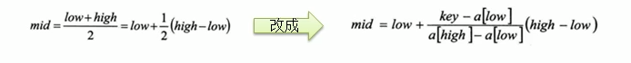

# 数据结构

## 一、数据结构和算法的概述

线性结构： 数组，队列，链表和栈

非：二维数组，多维数组，广义表，树结构，图结构

## 二、稀疏数组

但部分元素值相同时， 可以转换为稀疏数组来存储

处理方法：

1、记录数组一共多少行多少列， 有多少个不同的值

2、把具有不同值得元素行列及值记录在小规模得数组中，缩小了存储规模

## 三、队列

#### 1、有序列表

链表或数组

#### 2、环形队列


```java
class CircleArrayQuery {
    private int maxSize;
    private int font;
    private int rear;
    private int arr[];
    public CircleArrayQuery(int size) {
        maxSize = size;
        arr = new int[size];
        font = 0;
        rear = 0;
    }
    public boolean isEmpty() {
        return font == rear;
    }
    public boolean isFull() {
        return (rear + 1) % maxSize == font;
    }
    public void add(int data) {
        if (isFull()) {
            System.out.println("队列已满");
        } else {
            arr[rear] = data;
            rear = (rear + 1) % maxSize;
            show();
        }
    }
    public void get() {
        if (isEmpty()) {
            System.out.println("当前队列为空");
        } else {
            int index = (font + 1) % maxSize;
            font = index;
            show();
        }
    }
    public void show() {
        System.out.println(font + "," + rear);
        if (isEmpty()) {
            System.out.println("当前队列为空");
        } else {
            for (int i = font; i < font + size(); i++) {
                System.out.printf("arr[%d] = %d", i % maxSize, this.arr[i % maxSize]);
            }
            System.out.println();
        }
    }
    public int size() {
        return (rear + maxSize - font) % maxSize;
    }
}
```

## 四、单链表

#### 1、介绍

1、以节点的方式存储

2、data域、next域

3、各个节点不一定连续

4、链表分带头结点的链表和没头节点的链表

#### 2、面试题

反序链表

```java
public void reverList(){

        if(head.next == null){
            System.out.println("列表为空不进行反序");
        }
        LinkedData data = head.next;
        LinkedData next;

        LinkedData newHead = new LinkedData(0, null);
        while (data != null){
            next = data.next;
            data.next = newHead.next;
            newHead.next = data;
            data = next;
        }
        head = newHead;
    }
```

反序打印

```java
//利用栈进行打印
Stack<Node> list = new Stack<Node>();
```

## 五、双向链表

#### 1、介绍

单向链表，查找方向只有一个

单向链表不能自我删除，通过待删除的前一个节点来删除的

## 六、单向环形链表（约瑟夫环形链表）

## 七、栈

#### 1、应用

子程序调用

递归调用

表达式求值和转换（中缀表达式转后缀表达式）

二叉树的遍历

图的深度优先搜索法

#### 2、介绍

先入后出， 栈底不变， 栈顶变化

#### 3、栈实现综合计算器

#### 4、前缀中缀后缀表达式


#### 5、中缀转后缀表达式


## 八、递归

#### 1、规则

每个方法开辟一个独立栈空间

每个空间的数据是独立的

#### 2、八皇后问题

```java
/**
     * 递归
     * @param n
     */
private void check(int n){
    if(n == max){
        print();
        return;
    }
    for(int i = 0; i< max; i++){
        arr[n] = i;
        if(judge(n)){
            check(n+1);
        }
    }
}

/**
     * 校验
     * @param n
     * @return
     */
private boolean judge(int n){
    for(int i = 0; i< n; i++){

        if(arr[i] == arr[n] || Math.abs(n-i) == Math.abs(arr[n] - arr[i])){
            return false;
        }
    }
    return true;
}
```

## 九、排序算法


### 1、度量算法执行时间

1、事后统计

2、事前预估

### 2、介绍

#### 1、时间复杂度

基本介绍， 散发花费的时间与算法的执行次数成正比，哪个算法中语句执行次数多，他花费时间就多。一个算法中的语句执行次数成为语句拼度或时间频度（T(n)）;

在时间复杂度的可以忽略常数项，忽略低次项，高次项的系数可以忽略

常用  O(1)常数，O(lgn)对数，O(n)线性，O(nlgn)线性对数阶，O(n^2)平方，O(n^3)立方，O(n^k)k次方，O(2^n)指数阶 


#### 2、空间复杂度

### 3、排序

#### 1、冒泡排序

优化： 如果某次排序过程中没有进行交换可以提前终止交换

速度： 80000个5秒左右

#### 2、选择排序


优化： 由于在交换时， 可能首个数字就时最小， 如果index与最小的相同 则不进行交换

速度：80000个2秒左右

```java
public static void selectSort(int[] arr){
    for (int i = 0; i < arr.length; i++) {
        int minIndex = i;
        int min = arr[i];
        for (int j = i + 1; j < arr.length; j++) {
            if(min > arr[j]){
                min = arr[j];
                minIndex = j;
            }
        }
        //优化
        if(minIndex != i) {
            arr[minIndex] = arr[i];
            arr[i] = min;
        }
    }
}
```

### 3、插入排序

优化：

速度：80000条三秒左右

```java
public static void insertSort(int arr[]){
    for (int i = 1; i < arr.length; i++) {
        int insertVal = arr[i];
        int insertIndex = i-1;
        while(insertIndex >= 0 && insertVal < arr[insertIndex]){
            arr[insertIndex + 1] = arr[insertIndex];
            insertIndex--;
        }
        //优化
        if(insertIndex +1 != i) {
       		arr[insertIndex+1] = insertVal;
        }
    }
}
```

### 4、希尔排序

#### 插入排序问题：插入排序时后移次数过多问题，希尔排序优化写入排序

#### 1、交换法

#### 2、移动法（结合了插入排序和 分批排序， 减少了插入排序的交换次数）

```java
public static void hillSort(int arr[]){
    for (int i = arr.length/2; i > 0; i=i/2) {
        for (int j = i; j < arr.length; j=j+i) {
            int insertVal = arr[j];
            int insertIndex = j-i;
            while(insertIndex >= 0 && insertVal < arr[insertIndex]){
                arr[insertIndex + i] = arr[insertIndex];
                insertIndex = insertIndex - i;
            }
            if(insertIndex + i != j) {
                arr[insertIndex + i] = insertVal;
            }
        }
    }
}
```

### 5、快速排序

```java
public static void fastSort(int arr[], int i, int j) {
    int low = i;
    int high = j - 1;
    int value = arr[j];
    while (low < high) {
        for (; low < j; ++low) {
            if (arr[low] > value) break;
        }
        for (; high > i; --high) {
            if (arr[high] < value) break;
        }
        if (low < high) {
            swap(arr, low, high);
        }
    }
    swap(arr, high + 1, j);
    if (high + 1 < j) {
        fastSort(arr, high + 1, j);
    }
    if (i < high) {
        fastSort(arr, i, high);
    }
}
```

### 6、归并排序


```java
public static void split(int arr[], int left, int right, int temp[]){
    if(left < right){
        int mid = (left + right) / 2;

        split(arr, left, mid, temp);
        split(arr, mid+1, right, temp);

        merge(arr, left, mid, right, temp);

    }
}
public static void merge(int arr[], int left, int mid,  int right, int temp[]){
    int l = left;
    int r = mid+1;
    int tempIndex  = 0;
    //比较大小依次填入tmp数组
    while(l <= mid && r <= right){
        if(arr[l] <= arr[r]){
            temp[tempIndex++] = arr[l++];
        }else{
            temp[tempIndex++] = arr[r++];
        }
    }
    //将剩余数组的信息 直接填充到tmp 数组中
    while(l <= mid){
        temp[tempIndex++] = arr[l++];
    }
    while(r <= right){
        temp[tempIndex++] = arr[r++];
    }

    //将数据复制到源数组
    int t = 0;
    int tempLeft = left;
    while(tempLeft <= right){
        arr[tempLeft++] = temp[t++];
    }
}
```

### 7、基数排序


## 十、查找算法

### 1、顺序查找法

### 2、二分查找法

### 3、插值查找法

对二分查找进行优化，不需要直接折半，更快速查找数据 



### 4、斐波那契查找

对mid进行优化

