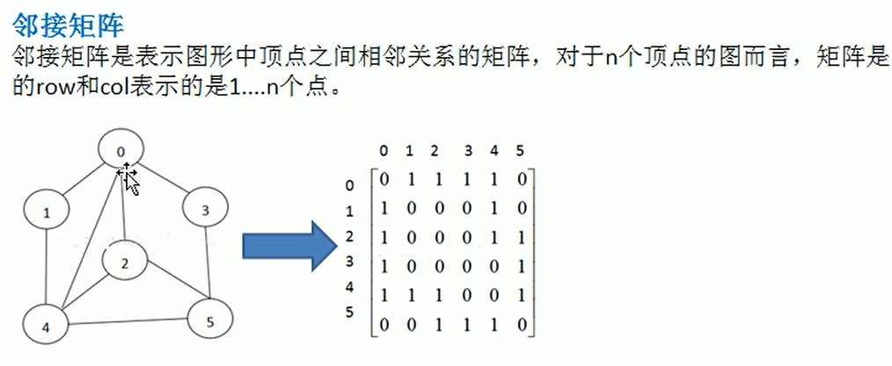
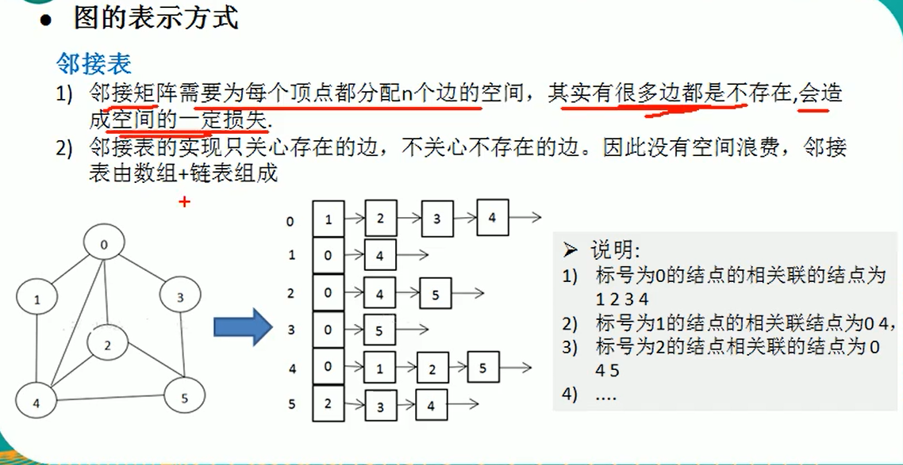

# 图

## 一、介绍

### 1、概念

一个节点可以有零个或多个相邻元素

### 2、常用概念

1、顶点

2、边

3、路径

4、无向图

5、有向图（顶点之间有方向）

6、带权图（边带权值）也叫网

### 3、表示方式

二维数组（邻接矩阵）链表（邻接表）

## 二、图遍历

### 1、深度优先遍历（DFS）

1、访问策略是优先王纵深挖掘深入，而不是对一个节点的所有临界节点进行横向访问。

2、深度优先搜索时一个递归的过程 

### 2、广度优先遍历（BFS）

