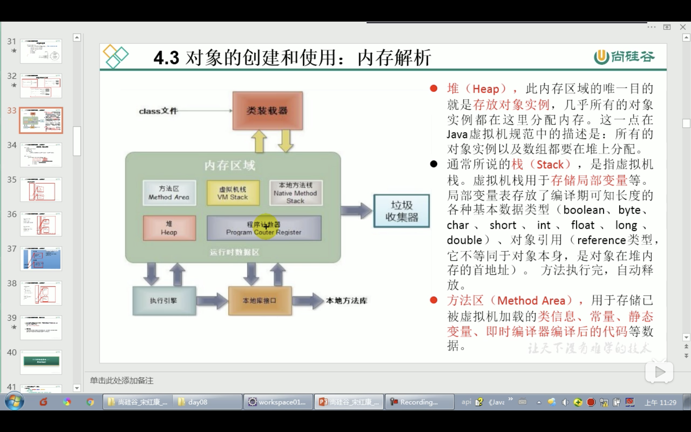

# 面向对象（200集）

## 一、简介-Java学习三条主线

#### 1、Java类以及类的成员

1、属性、方法、构造器

2、代码块、内部类

#### 2、面向对象的三大特征

封装性、继承性、多态性，抽象性

#### 3、其他关键字

this，super，static，final，abstract，interface，package，import

## 二、面向对象

### 1、面向过程和面向对象（大象装冰箱步骤，企业创业到成熟的过程）

面向过程，强调的功能行为，以函数为最小单位，考虑怎么做。

面向对象，强调的功能对象，以对象为最小单位，考虑谁来做

执行者转向指挥者的过程‘；

### 2、要素

类，对象：对象由类派生出来的

面向对象程序设计重点是类的设计

#### 2.1、类

##### 1、属性：

成员变量=field=域、字段

属性变量和局部变量的区别和相同

1、相同

1.1、定义格式，先声明后使用，变量都有其对应的作用域

2、区别

2.1、在类中声明位置不一样

2.2、关于权限修饰符不同：

属性可以在声明属性时使用权限修饰符：private public 缺省 protected，局部变量不能修饰

2.3、默认初始化值

属性：有初始化值，基础数据类型、引用数据类型（类，接口、数组）为null

2.4、内存中加载的位置

属性：堆空间

局部变量：加载到栈空间中

##### 2、方法

成员方法=method=函数

1、权限修饰符

2、返回值类型

3、方法重载

一个同名方法，参数类型和参数个数不一样可以；；；；；；

**跟方法的权限修饰符、返回值类型、形参参数名、方法体都没关系**

对象调方法时，会进行自动类型提升

4、可变个数形参的方法

数据类型 ... 变量名，可匹配 0，1，n个都行，

如果出现确定的个数， 优先匹配

与类中方法名相同，类型相同的数组构成重载

5、形参传值只有一种方式：值传递——》如果基本数据类型，则传值，如果是引用数据类型，则传递复制的变量所在的地址值（含变量的数据类型）

``` java
int[] intArr = new int[];
sout(intArr);//输出地址值
char[] charArr = new char[];
sout(charArr);//输出列表，由于sout参数问题

//String 是不可变类
String s="1";
test.change(s);
sout(s);//输出hello

Test.change(String s){
    s = "h~~~"
}


```


##### 3、创建类

类的初始化=类的实例化

##### 4、创建类对象

都会初始化变量值

##### 5、对象内存解析



堆（heap）:存放对象实例

栈（stack）：用于存放局部变量，局部变量表存放编译时期可知长度的基本数据类型，对象引用。方法执行完成，自动释放

方法区：用于存储已被虚拟机加载的类信息、常量、静态变量、即使编译后的代码等数据

##### 6、匿名对象的使用


### 3、万事万物皆对象

1、在Java语言范畴中，我们都将结构功能等封装到类中，通过类的实例化，来调用具体的功能结构

2、涉及到Java语言与HTML与数据库交互时，都体现为类、对象

## 三、封装与隐藏

### 1、简介

为了对属性赋值进行一些额外的限制条件

### 2、封装体现

1、将属性xxx私有化，并提供public的set和get方法

2、不对外暴露的私有方法

3、单例模式

### 3、封装性的体现，需要权限修饰符来配合

#### 1、四种权限：

private（类内部）、缺省（+同一个包）、protected（+不同包的子类）、public（+同一个工程）

#### 2、修饰的内容

内部结构：属性，方法、构造器、 内部类

类：缺省（只能在同一个包内调用）、public

#### 3、总结

Java提供四种权限修饰类及类的内部结构，体现类及类的内部结构在被调用时的可见性大小。

## 四、构造器

### 1、作用

1、创建对象

2、初始化属性值

### 2、说明

1、如果类没有显示定义类的构造器时，系统默认提供无参构造器

2、构造器的格式

3、构造器与方法用的位置不一样

4、一个类中的多个构造器叫做重载

5、一旦显示定义类的构造器，系统不提供默认的空参构造器

### 3、属性赋值先后顺序

1、默认初始化值2、显示初始化；3构造器；4调用方；

## 五、JavaBean

### 1、规范

类公共，有无参公共的构造器，有属性，且有对应的get、set方法

### 2、介绍

### 六、URL类图

## 七、this关键字

### 1、为什么

当方法内需要用到调用该方法的对象时，就用this

### 2、使用

this可以修饰：属性，方法，构造器

1、修饰属性方法：this=对象

2、修饰构造器：

2.1、可以显示的this(形参列表)，调用其他构造器

2.2、this()必须放在首行

2.3、构造器内部只能调用一个构造器

## 八、关键字package、import

### 1、package

1、为了更好的实现项目中类的管理，提供类的概念

2、声明类所属的的包

3、命名规则，见名知意

```java
import java.lang;
import java.net;
import java.io;
import java.utils;
```

### 2、import类/接口

1、如果时java.lang包下的则可以直接省略import结构

2、本包下的可以省略

3、子包下的还需显示导入

4、导入类中的静态结构，属性和方法：import static java.lang.Math.*;

## 九、MVC设计模式


## 十、继承性

### 1、简介（WHY）

1、减少代码冗余，提高代码复用性

2、便于功能扩展

### 2、格式

class A extends B{}

A： 子类、派生类

B：父类，基类，超类

#### 体现：

继承父类中声明的属性和方法，

私有的属性也获取到了， **只是封装新的影响，使子类不能直接调用父类的结构而已**

### 3、说明

1、一个类可以被多个子类继承

2、类的单继承：一个类只能有一个父类

3、子类直接继承的类直接父类， 间接继承的类间接父类

4、子类继承父类后，获取了直接父类以及所有间接父类中声明的属性和方法

5、Object时所有类的父类

## 十一、方法从写

### 1、介绍

父类的方法进行修改

### 2、规定

1、方法声明

2、权限

子类重写方法的权限修饰符不小于父类被重写的方法的权限修饰符。

特殊情况， 子类不能重写父类中声明为private的方法

3、返回值

被重写的方法的返回值是void 则子类的重写的方法返回类型只能是void

被重写的返回值类型是A 子类重写的方法的返回值类型可以是A或A类的子类

4、重写方法抛出异常的类型，不大于被重写的方法抛出的异常类型

5、static方法不能被重写

### 3、protected

private = 类中

default =+ 同包下可以使用

proteced =+不同包的子类

public =+ 相同项目

## 十二、SUPPER

### 1、简介

子类重写了父类的方法，如果想用父类中的原方法属性构造器，则使用super

### 2、使用

#### 1、方法

如果子类定义的属性和父类同名，直接调用属性民是调用子类中数据===this.属性名， 掉父类中的使用super.属性名

#### 2、属性

#### 3、构造器

1、super(形参列表)；必须声明在子类构造器中首行

2、在类中this()和super()只能二选一

3、构造器首行没有写super()或this()，则默认调用super()

4、在类的构造器中，至少有一个构造器使用了super()，调用了父类构造器

### 3、子例实例化的过程

1、结果上看，当子类继承父类后，获取了父类声明的属性和方法，创建子类的对象，在对空间中，会加载父类所有声明的属性和方法

2、从过程上看：子类构造器时，都会直接或间接调用父类的构造器，知道调用了Object的空参构造器为止

3、正因为加载过父类的结构，所以在内存中能看到父类的结构，子类才可以考虑调用

**说明：虽然调用了父类的构造器，但只创建过一个对象**


## 十三、多态

### 1、说明

理解为一个事物的多种形态，不适用于属性；

子类继承父类后，可以对父类中同名同参数的方法进行覆盖操作

### 2、体现

1、对象的多态性

父类的引用指向子类的对象，调用方法时， 调用子类重写的方法——虚拟方法调用，**不能调用特有的方法**，只能调用父类声明的方法，运行时执行子类重写的方法

**编译看左，运行看右**

### 3、使用前提

父类继承，方法重写

### 4、使用的原因

有了多态才有接口定义规范的能力， 其中一个好处就是大幅提升了代码的复用性。

### 5、注意点

对象只适用于方法，不适用于属性：运行时如果子类父类都有某属性值，调用父类的方法， 不关方法的事

### 6、虚拟方法调用

子类父类定义了相同的方法，在多态情况下，此时父类方法称为**虚拟方法**。父类根据赋予不同子对象，动态调用子类的方法。

方法调用是在运行时确定的，动态绑定是运行时类型

### 7、重载和重写区别

1、定义细节概念：

2、重载和重写的规则

3、重载不表现为多态性，重写表现为多态性

3、编译运行角度来说

重载在编译过程中，调用地址就绑定了，在方法调用之前就确定了要调用的方法，称为“早绑定“或”静态绑定“

重写在运行的过程中，才能确定所调用的具体方法，这称为”晚绑定“或动态绑定

### 8、重写规则

形参列表相同

权限修饰符权限大于等于

返回值——可以是子类

抛出的异常——大于

### 9、instanceof操作符

1、用法

为了在向下转型时避免出现类型转换异常，在向下转型时判断是否是类型（必须是子父类，不然编译通过）

2、判断域

只要是类型或者父类都是true（instanceof Object == true）

有了对象多态性以后，内存中实际加载了子类特有的属性和方法

，但是由于声明为父类类型，导致编译时只能调用父类生命的方法和属性，子类特有的属性和方法不能直接调用

如果想转换，直接转换数据类型（向下转型，向上转型是多态）

4、使用

```java
a instanceof A 
//判断对象是否是A的实例是返回true 不是返回false
```

5、问题

```java
//编译时通过运行时不通过
Person p = new Woman();
Man man = (Man)p;
//编译时通过运行通过
//可以强转为父类
```

### 10、若子类中定义了与父类相同的成员变量，则变量名为什么类型，则调用哪个类的属性，就近原则

### 11、方法如果重写了， 调用的都是子类的方法

### 12、测试

```java
//下面Sub是对ADD方法进行了重写，如是多态b调用时  输出 子类的实现
//不掉add(a,b,c)的原因是  Base 对象没有 add(a,b,c)的方法， 只能调用重写了的方法  add(a, ... b);
class base{
    public void add(int a, int ... b);
}
class Sub{
    public void add(int a, int[] b);
    public void add(int a, int b, int c);  
}
class Test{
    main(){
        Base b = new Sub();
        b.add(1,2,3);
    }
}
```

### 13、理解多态

1、代码通用性

2、抽象类、接口的使用体现多态性

## 十四、Object的使用

### 1、clone

复制对象

### 2、finalize

垃圾回收GC回收之前调用

### 3、equals方法

比较方法是否相等

```java
//==和equals的区别
==：运算符；
1、可以用在基本数据类型和引用数据类型变量中
2、基本数据类型都是比较真实存储的值是否相等，不一定类型相等，有自动类型提升
3、比较引用数据类型，比较地址值是否相等
equals():方法
1、不能使用基本数据类型变量
2、只适用于引用数据类型
3、Object.equals()中定义的 和==作用相同，比较地址值
4、String.equals();重写了Object的equals方法，比较对象内容
```


### 4、toString方法

1、当我们输出一个对象的引用时，实际上是调用对象的toString的方法

2、Object.toString()


## 十五、包装类Wrapper

### 1、介绍

希望基本数据类型也有类的特征，针对八种基本数据类型对应的引用类型——包装类（封装类）

数值型的都有父类Number

### 2、转换

#### 基本数据类型和包装类的转换

##### 调用包装类的构造器

Boolean忽略大小写不是true否则都是false

##### 包装类转换为基本数据类型

xxxValue()

##### 自动装箱与拆箱（JDK5.0）

#### 基本数据类型与包装类转换为String

基本数据类型：连接运算，调用String.valueOf()


#### String转换为基本或包装类

包装类的parse


```java
Object o = true ? new Integer(1): new Double(2.0);  
//涉及到自动类型提升， 1.0

Integer n1 = 1;
Integer n2 = 2;
n1 == n2; true;
由于在内存中IntegerCache自动生成了-128-127的数据，如果直接等于则直接找，获取地址值，所以等于， 为了提高效率
大于时相当于在自动装箱时new了一个对象
```

## 十六、static关键字

### 1、说明

某些特定的数据在内存空间中只有一份

### 2、static可以用来修饰属性，方法，代码块，内部类

### 3、属性：

静态变量（类变量）VS非静态变量（实例变量）

静态变量：多个对象共享同一静态变量，其他变量修改或调用静态变量都是同一个变量