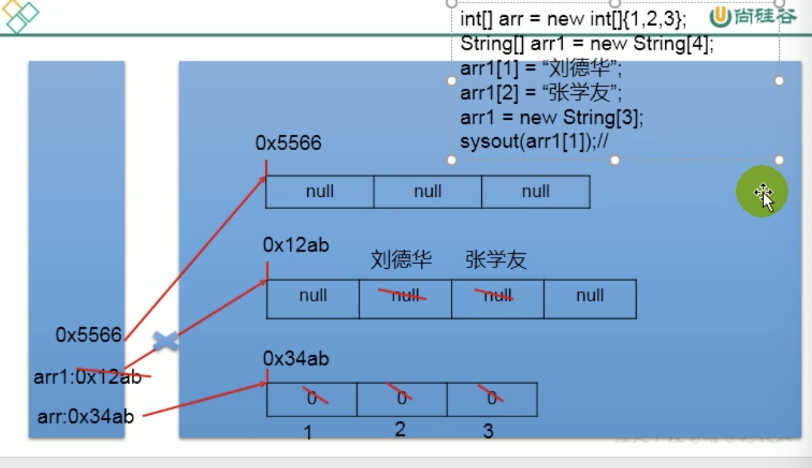

# 数组

### 一、 描述

1、相关概念：数组名称，数组元素、角标，下标，索引

2、有序：数组是有序的

3、数组是引用数据类型，数组的元素可以基本数据类型或引用数据类型

4、内存空间是连续的空间，长度一旦确定就不能修改

### 二、分类

按维数：一维二维

按元素：基本数据类型，引用数据类型

```java
1、一维数组使用
//声明初始化：
静态初始化：
int[] a = new int[]{1,2,3,4,5};
int[] a = {1,2,3,5};
动态初始化
String[] names=new String[5];
//默认初始化值
基本数据类型：整型都是0，浮点型0.0，char 0，boolean：false(0) 
引用数据类型：String(null)
//内存解析
/**
内存结构：
栈stack(线性存储) :局部变量(方法中的变量)
堆heap：new出来的 对象/数组
方法区(常量池，静态域)
*/

```



```java
//二维数组：理解是一维数组的元素是数组
//声明初始化
int[][] a = new int[2][4];
//默认初始化值
外层默认值是地址值如果未初始化则是null
```

### 二、排序

#### 1、衡量排序算法优劣

时间复杂度：分析关键字的比较次数和记录的移动次数

空间复杂度：分析排序算法中需要多少辅助内存

稳定性：若两个记录关键字值相等，排序后次序不变，则排序算法稳定

#### 2、排序分类

内部排序：内存

外部排序：磁盘

#### 3、十大算法

1、选择：直接选择，堆排序

2、交换：冒泡、快速

3、插入：直接插入、折半插入、shell排序

4、归并

5、桶式

6、基数

#### 4、算法5个特征

输入、输出、有穷性、确定性、可行性

#### 5、排序算法性能

1、n较小（50）可采用直接插入或直接选择排序

2、锁文件初始状态基本有序，则应选用直接插入、冒泡，或随机的快拍

3、n较大，则采用时间复杂度nlgn的：快排，堆排序，归并

#### 6、数组工具类Arrays

操作数组的工具类

1、equals

2、toString

3、fill

4、sort：底层排序用快排

5、binarySearch

#### 7、查找

1、线性查找

2、二分法查找