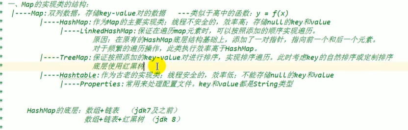
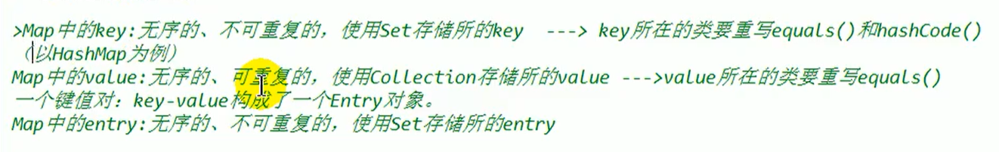
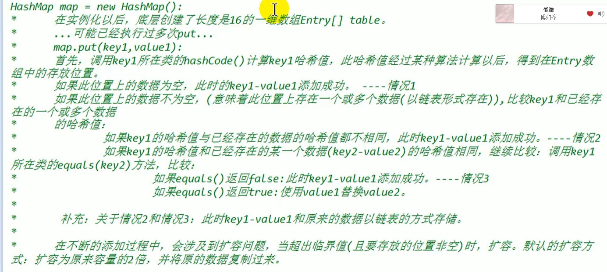
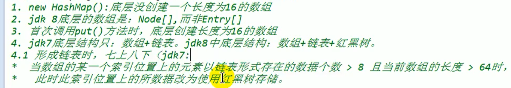
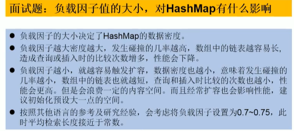

# 集合框架

## 一、集合概述

对多个对象进行存储与数组的比较

数组在存储的特点：数组一旦 定义，长度和元素都确定了

缺点：  

长度确定，不可修改，扩展不方便，

数组提供方法非常有限，操作不方便，效率不高。

存放有序和可重复的数据，对于无需，不可重复 的需求不能满足

## 二、框架分类：

Collection：单列数据

List:有序，可重复

ArrayList LinkList Vector

Set：无需，不重复

HashSet,LinkedHashSet,TreeSet

Map：双列数据，key-value数据

HashMap,LinkedHashmap, TreeMap, HashTable, Properties

## 三、Collection接口API（15）

1、add，addAll

2、clear

3、contains调用equals()方法

4、removeAll差集

5、retainAll交集

6、Iterator遍历

```java
迭代器设计模式;
Collection每次iterator都会返回一个对象;
next 先下移，再把位置的元素返回;
默认游标在第一个元素之前;
foreach 方法,集合内部使用Iterator;
增强for循环 不修改数组的内容
   int[] a = {1,2,3};
for(int b : a){
    b = 2;
}
不能改变数组的内容，临时变量
```

## 四、List

### 1、介绍

List:有序，可重复

ArrayList ：jdk1.2线程不安全，效率高，底层使用Object[] elementData存储

LinkList ：底层使用双向链表存储，频繁添加删除效率高

Vector：jdk1.2线程安全，效率低，底层使用Object[] elementData存储

相同点： 都是List的实现类， 存储数据特点：有序，可重复的内容

### 2、Array List源码分析

#### JDK7

底层创建长度为10的Object数组

grow()扩容至1.5倍，Arrays.copyOf(新数组，旧数组)

#### JDK8

在初始化的时初始化为： Object[] element = {}，在第一次调用Add才创建长度为10的数组

后续添加扩容操作一致；

#### 原因：延迟数组初始化，节省内存

### 3、LinkedList源码分析

```java 
Node<E> first;
Node<E> last;
//Node为内部类
add()->{linkedLast()}

```

### 4、Vector源码分析

扩容方式不一样：扩容到二倍

### 5、List的常用方法

## 五、Set接口

### 1、介绍

HashSet：作为Set基本实现类，线程不安全，可存放null值

LinkedHashSet：作为HashSet的子类， 便利内部数据时， 可以按照添加的顺序遍历

Tree：可以按照添加元素的制定属性，进行排序

无序性：不等于随机性，存储的顺序在底层数组中并非按照数组索引的顺序添加，而是通过数据的哈希值排序

不可重复性：保证添加的元素按照equals方法，不能返回true。即相同元素只能添加一个

### 2、添加元素的过程：HashSet为例

需要重写hascode 和equals方法

先计算元素的Hash值

像HashSet中，添加元素a，先调用元素所在类的hashcode()方法，计算元素的哈希值

此哈希值按着通过某种算法计算出Hash Set在底层数组中的存放位置

如果当前位置没元素，直接添加

如果位置上有其他元素（以链表方式存储元素），比较元素a和元素b的值，

如果哈希值不同，则添加元素a成功

如果hash值相同，则调用元素a所在类的equals方法

equals true 添加失败

equals false 添加成功

> 链表存储时，jdk7中 元素a放到数组中，只想原来元素，JDK8中，原元素在数组中，指向元素a——————七上八下

#### 为什么在HashCode方法中会有31这个数字

1、选择系数的时候要选择尽量大的系数，因为如果计算出来的hash地址越大，所谓的冲突就越少，查询效率也会提高

2、31值占用5bits，相乘造成数据溢出的概率较小

3、31可以由i* 31 == i<<5 -1来表示，现在虚拟机里面都有做优化

4、31是个素数，素数的作用就是如果我用一个数字来诚意这个素数， 最终出来的结果只能被素数本身和被除数与1来整除（减少冲突）

### 4、LinkedHashSet

添加的时候存储位置是无序的， 但是还维护了两个变量，前一个指向后一个，添加的先后顺序。访问效率高于HashSet

### 5、TreeSet,可以按照对象制定属性排序

TreeSet中的数据，要求是相同类的对象。不能添加不同类的对象

对象需要实现Comparable接口

自然排序中，比较两个对象的标准是compareTo返回0 不再是equals()

定制排序中，比较两个对象的标准是compare()返回0， 不再是equals()

```java
HashSet set = new HashSet();
Person p1 = new Person(1,1);
Person p2 = new Person(2,2);

set.add(p1);
set.add(p2);

sout;//2个

p1.name = 3;
set.remove(p1);//不能成功， hashcode有关
set.add(p1);//可以添加成功

set.add(new Person(1,1));//可以添加成功
```

## 六、Map

### 1、介绍实现结构

双列数据，存储key-value对的数据

HashMap（1.2）:线程不安全，效率低，可存储null（底层存储：JDK7前：数组+链表，JDK8：数组+链表+红黑树）

​	LinkedHashMap（1.4）保证在遍历map元素时，可以按照添加的顺序实现了遍历

​		在原有Hashmap的基础，添加了一对指针， 指向前一个和后一个元素

Treemap(1.2)：进行排序，实现排序遍历，使用key进行自然排序和定制排序底层使用红黑树

HashTable（1.0）线程安全，效率高，不能存储null

​	Properties

### 2、

key——用set存储，无序，不可重复性。key所在对象需要重写hascode和equals

value——用Collection存储，无序，可重复性

entry：无序，不可可重复， Set存储

### 3、HashMap底层实现原理

```java
new HashMap();

////JDK7

//实例化后，创建了一个长度为16的一维数组entry[] table
map.put(k,v);
/*调用K的hashcode计算哈希值，通过计算，得到Entry数组中的存放位置
如果为空，直接添加
如果不为空，（一个或多个数据链表存储），比较key1和已存在的数据的哈希值
		如果不同，直接添加
		如果和某个已存在的哈希值相同，继续比较调用key所在类的equals方法，比较
			如果equals为false, 直接添加成功
			如果equals为true，使用values替换旧的数据
*/

/*扩容方式：扩容原容量的2倍*/

//JDK8 的不同
new HashMap();
//没有直接创建数组，首次创建时，再去创建
//底层存储的数组时 node[] 非Entry
//jdk底层结构为：数组+链表+红黑树（数组以链表存储的存储的个数>8,且当前数组的长度>64,此时此索引位置上的所有数据改为红黑树存储）
```

源码解析JDK7

```java

//空参构造器
threshold 临界值 加载因子（loadfactory 0.75）* capacity;//扩容临界值
Entry[] tables;
int hash = hash(key);
int i = indexFor(int h, int length){
    return h&(length-1);
}
//添加元素
createEntry(int hash, K key, V value, int index){
    Entry[k, V] e = table[index];
    //把原有位置数据存储为新元素的next数据
    table[index] = new Entry<>(hash, key, value, e);
    
}
```

源码解析JDK8

```java
new HashMap();
//初始化加载因子
add
    putVal

DEFAULT_INITIAL_CAPACITY：默认容量16;
MAXIMUM_CAPACITY:最大容量 2^30;
DEFAULT_LOAD_FACTOR:默认加载因子0.75;
TREEIFY_THRESHOLD:链表长度大于默认值，转为红黑树;
UNTREEIFY_THRESHOLD:小于默认值，转换为链表;
threshold：扩容临界值： 容量*填充因子;
modCount：扩容和表改变的次数;
loadFactor: 扩充因子;
```

### 4、LinkedHashMap底层实现

可以记录元素添加的顺序，遍历展示元素的添加顺序

```java
Entry implement HashMap.Node<K,V>{
Entry<K,V> before, after;//能够记录添加元素的顺序
}
HashSet.add(){
    map.put(e, new Object());
}
```

### 5、常用方法

#### 原视图操作方法

keySet

values

entrySet

### 6、TreeMap

必须要相同类型

### 7、Properties

主要处理配置文件，key-value都是String类型的数据

### 8、Collections

#### 1、与Collection对比

一个接口（List，Map），一个工具类

#### 2、常用方法

1、reverse

2、shuffle(List)对List随机排序

3、sort自然排序，元素类需要实现Comparable接口

4、sort（List，Comparator）

5、frequency：统计某个个元素出现的次数

6、copy（trg，src）：初始化trgList需要List trg = Arrays.asList(new Object[siez])

7、同步控制：方法可使将只能怪集合包装成线程同步的集合，从而可以解决多线程并发访问集合时的线程安全问题：synchronizedList()

8、Enumeration迭代器Iterator的古老版本

## 七、数据结构

#### 真实存在 

顺序表，链表，

#### 抽象结构：

##### 栈、

##### 队列

（消息队列，时间队列，CPU的作业调度，顺序表和链表可以实现），变形：环形，双向，优先

##### 树

根据链表造出来的

B+树，哈夫曼树

深度优先遍历：前序中序后续

广度优先遍历:

##### 图

## 八、知识点

#### 1、Map类特点





#### 2、JDK7Hash Map实现



#### 3、JDK8区别



#### 4、Collection和Collections的区别

Collection是接口 有List和Set， 存储单列数据。

Collections是工具类可以操作Collection和Map的数据

#### 5、关键字解释

