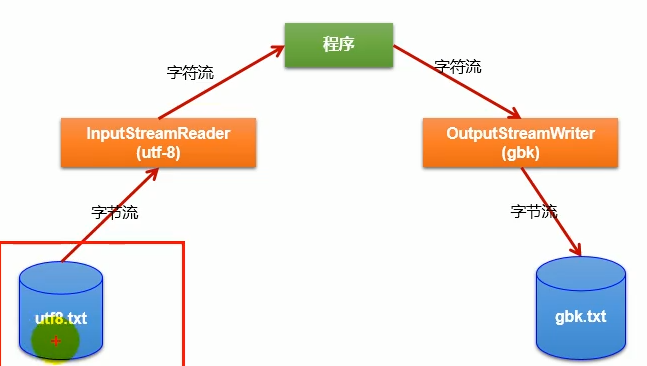

# IO流

## 一、常用方法

1、获取绝对路径：getAbsolutePath

2、获取相对路径：getPath

3、获取文件长度：getLength

4、获取修改时间：lastModifyed

5、list：呈现文件夹下文件和文件目录，String[]

6、listFile：File[]，输出绝对路径得信息

7、renameTo：把文件重命名为指定得文件路径，要想保证充公，源文件存在， 目的文件不存在

8、isDirectory：是否是目录

9、isFile：是否是文件

10、exists：存在判断

11、canRead/canWrite

12、isHidden：是否隐藏

13、createNewFile()：创建文件

14、mkdir：创建文件目录

15、mkdirs：如果上层不存在，一并创建

## 二、原理及分类

1、数据单位不同：字节流（8）、字符流（16）

2、流向不同：输入流，输出流

3、角色不同：节点流，处理流

## 三、结构

### 抽象基类： 

InputStream、OutputStream、Reader、Writer

### 节点流（文件流）：

File（InputStream、OutputStream、Reader、Writer）

### 缓冲流(处理流)   8192的缓存区

,提升数据的读取和写入的速度

Buffered（InputStream、OutputStream、Reader、Writer）， flush

### 转换流（字节的流转换为字符的流）

InputStreamReader，OutputStreamWriter

#### 1、作用：提供字节流与字符流之间的转换

#### 2、解码，编码

#### 3、字符集

常见的编码： ASCII（美国交换码 7位），ISO-8859-1（拉丁编码，欧洲 8位），GB2312、GBK，Unicode，UTF-8

