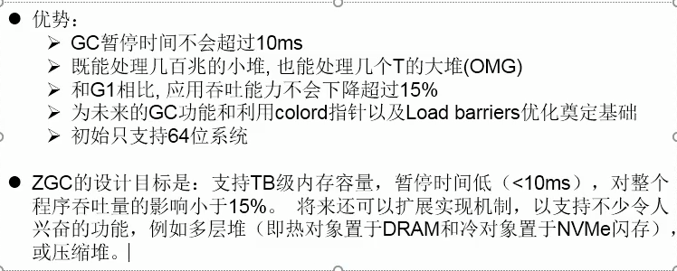

# JDK9 特性

### 1、目录结构变化

### 2、模块化

### 3、JShell工具

### 4、接口中声明私有方法

### 5、try结构语句问题

```java
//jdk7-必须手动关闭资源
//jdk8可以将资源放入try()中， 声明和初始化
//jdk9可以只把变量名称放入try()中即可， 此时资源时final的， 不可在被赋值
```

### 6、String存储结构的变化

//为了节省空间

StringBuffer，StringBuilder， 以及 相关的类都变了  

char[] ——》 byte[]

### 7、集合工厂方法

```java
jdk8
//创建只读集合
Collections.unmodifiableList();
//只要add操作就抛异常
Arrays.asList();//返回的集合就是只读集合

jdk9;//list set map都有
List.of();//只读集合
Set.of();
Map.of();
Map.ofEntries(Map.entry(key,value));
```

### 8、InputStream的加强  transferTo

```java
InputStream.transferTo(OutputStream);//byte[8192] 8kb
```

### 9、StreamAPI

```java
takeWhile();
//返回从开头开始  第一个不满足之前的数据结束
dropWhile();
//第一个满足开始， 都要

//jdk8之前， 多个元素，可以包含null值，不能只填充空值
ofNullable();//只能包含一个值可以包含null值， 当为null时  个数为0

//jdk8的重载方法
iterator();


Optional.stream()
```

### 10、JavaScript引擎的升级Nashorn


# JDK10特性

12个JEP

### 1、局部变量类型推断：推断后写入字节码当中

```java
var num = 10;
var list = new ArrayList<String>();
//遍历操作
for(var i: list){}

//局部变量不赋值
//lambda表达式中，左边函数是接口不能声明var
//方法引用
//数组静态初始化
//局部变量不赋值， 就不能实现类型推断

//方法参数值，方法返回值，构造器的参数类型，属性，catch块， 为赋值的变量
var con = System.out::println;//错误
```

### 2、Collections.copyOf()

如果拷贝的时是只读集合， 那么返回值即为当前coll；如果当前集合不是只读，那么会返回一个新的只读集合

# JDK11特性

### 1、String中新增的方法

### 2、Optional

### 3、局部变量类型推断的小升级

### 4、Http客户端API

HttpClient 替换 HttpURLConnection： 9中引入， 11做了部分升级

```java

```

### 5、更简化的编译运行程序

```java
java a.java
    //只会执行第一个类的main方法
    //可以调用本文件的其他类， 但不能调用其他文件的类
```

### 6、废弃Nashorrn引擎

### 7、ZGC

