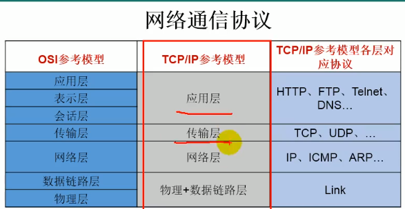

# 网络编程



## 一、网络编程的问题

1、如何准确定位一台主机

2、找到主机后如何可靠高效地进行数据传输

## 二、网络编程两个要素

### 1、对应问题1：IP和端口

IP：InetAddress唯一标识互联网主机

```java
InetAddress a = new InetAddress.getbyName("");
a.getHostName();
a.getAddress();

```

端口号：用于区分不同进程的不同的端口

0-1023 公认端口，注册端口（1024-49151），动态端口（49152-65535）

端口号+IP=Socket网络套接字

### 2、对应问题2：提供通信协议TCPIP模型

（应用层，传输层、网络层，数据传输层和链路层）

## 三、实例一

```java
//TCP
public void server(){
	server = new ServerSocket(8989);
    Socket s = server.accept();
    InputStream in = s.getInputStream();
    ByteArrayOutputStream baos = new ByteArrayOutputStream();
    byte[] buffer = new byte[5];
}
public void client(){
    InetAddress net = new InetAddress("localhost");
    socket = new Socket(net , 8989);
    OutputStream out = socket.getOutputStream();
    out.write("abc".getBytes());
}
//read阻塞式的操作  需要 socket.shutdownOutputStream();

//UDP
public void sender(){
    DatagramSocket socket = new DatagramSocket();    
    DatagramPacket packet = new DatagramPacket();
    socket.send(packet);
}
public void reciver(){
    DatagramSocket socket = new DatagramSocket();
    DatagramPacket packet = new DatagramPacket();
}
```

#### 2、URL类

```java
URL url = new URL("localhost:8080");
HttpConnection conn = url.openConnection();
conn.connect();
inputstream = conn.getInputStream();
```

