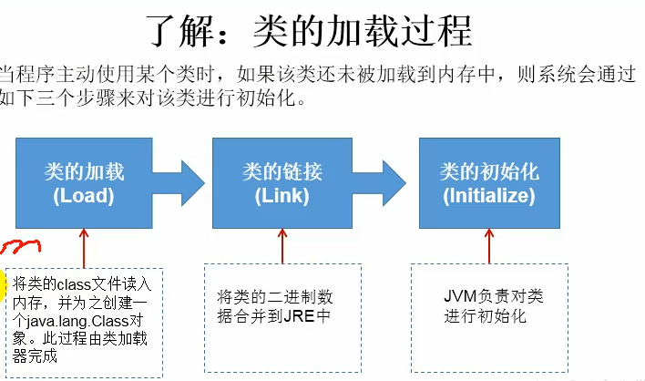

# 反射

## 一、概述

### 1、简介

允许程序在执行期间，借助ReflectionAPI取得任何类的内部信息，并能直接操作任意对象的内部属性和方法

封装性表示建议调的问题

反射是展示怎么去调的问题

### 2、关于Class的理解

1、类加载过程

程序经过javac.exe命令后，会生成一个或多个字节码文件.class， 接着用java.exe命令对某个字节码文件解释运行，将字节码文件加载到内存中，此过程称为类的加载。加载到内存中的类，我们称之为运行时类，此运行时类，充当为Class的实例

2、获取Class实例的方式

```java
//四种方法
//1
Class<Person> clazz1 = Person.class;
//2
Person p = new Person();
clazz2 = p.getClass();
//3
clazz3 = Class.forName("com.mark.Person");
//4
ClassLoader classLoader = Reflection.class.getClassLoader();
clazz4 = classLoader.loadClass("com.mark.Person");


clazz1 == clazz2 == clazz3 == clazz4;
```

3、加载到内存中的运行时类，会缓存一段时间；




**自定义类， 通过系统类加载器其加载**

**通过系统类加载器getParent：获取扩展类加载器**

## 二、创建运行时类的对象

```java
Class clazz = Person.class;
//调用空参构造器
//空参构造器 权限够
Person person = (Person)clazz.newInstance();
```

### 2、空参构造器的重要性

1、便于通过反射，创建运行时类的对象

2、便于子类继承此运行时类时，默认调用super()， 保证父类由此构造器

## 三、获取运行时类的内部结构

### 1、属性的获取

```java
//获取当前运行时类，以及其父类的public类型的属性值
clazz.getFields();

//获取当店运行时类中生命的所有属性（不包含父类的属性）
clazz.getDeclaredFields();
//修饰符
Field f = ;
int modifier = f.getModifiers();
//类型
Class type = f.getType();
//变量名
String name = f.getName();
```

### 2、方法结构

```java
//获取当前运行时类， 及其父类的Public类型的方法
clazz.getMethods();
//获取当前运行时类的所有方法
clazz.getDeclaredMethods();

//方法的结构
```


```java
m.getAnnotations();
//获取参数信息
Class[] paramerTypes = m.getParameterTypes();

//获取异常信息
Class[] exceptionTypes = m.getExceptionTypes();


```

### 3、构造器获取

```java
clazz.getConstructors();
clazz.getDeclaredConstructors();
```

### 4、父类

```java
clazz.getSuperClass();
//带泛型的父类
Type superClass = clazz.getGenericSuperClass();
//带泛型父类的泛型
ParameterizedType paramType = (ParameterizedType) superClass;
//获取泛型数组
Type[] actualTypeActualType = paramType.getActualTypeArguments();

```

### 5、运行时类实现的接口

```java
Clazz.getInterfaces();
```

### 6、运行时类坐在的包

```java
clazz.getPackage();
```

### 7、注解

```java
clazz.getAnnotations();
```

## 三、调用运行时类指定结构

### 1、调用属性

```java
clazz.getField();//public
clazz.getDeclaredField("name");
//private 需要调用  setAccessible(true);

field.set("对象"，"值");
field.get("对象");
```

### 2、调用方法

```java
method.invoke("对象", "参数值");
//如何调用静态方法
method.invoke(Person.class);
```

### 3、调用构造器

```java
clazz.newInstance();
//调属性构造器
Constructor con = clazz.getDeclaredConstructor(String.class);
Object person = con.newInstance("name");
```

## 四、动态代理

### 1、问题

1、如何根据加载到内存中的被代理类，动态的创建一个代理类及其对象

2、通过代理类的对象调用方法是， 如何动态的去调用被代理类的同名方法

```java
Proxy.newProxyInstance(obj.getClass.getClassLoader,
                      obj.getClass.getInterface,
                      InvocationHandler.)
```


