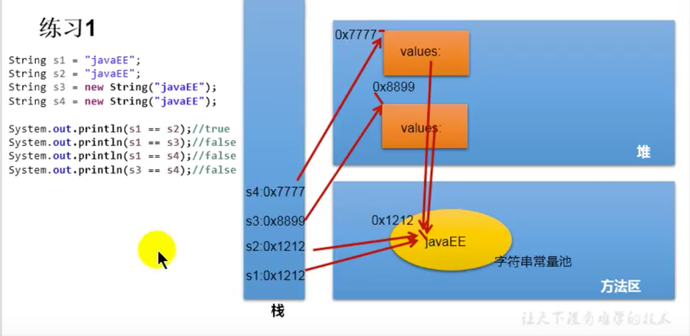
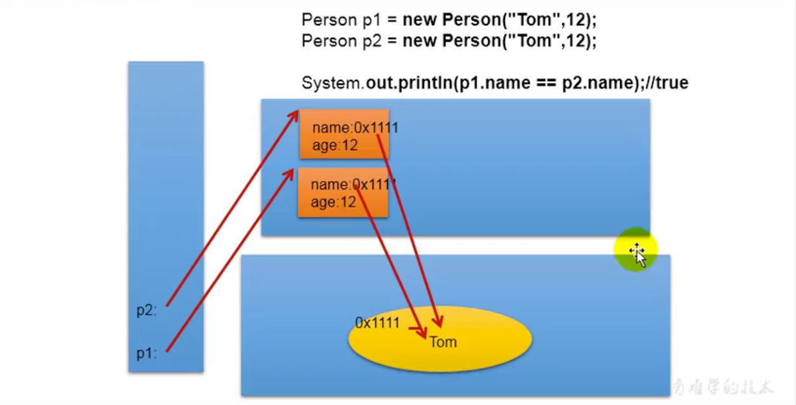
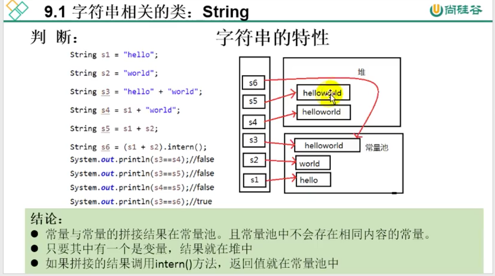
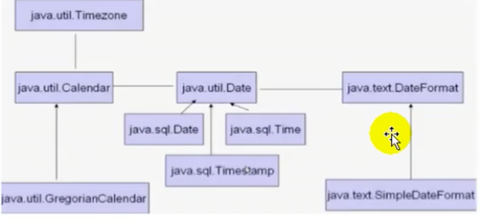

# Java常用类

## 一、字符串相关类

### 1、String的特性

1、不可变的字符序列

当重新字符串赋值时，需要重写指定内存区域赋值，不能使用原有value进行赋值

当进行字符串拼接时，————————————————————

当修改字符或字符串，

2、字符串是常量，用引号引起来，他们的值在创建后不可改变

3、内部定义final 的字符数组value[]，不可性字符

4、不可被继承

implements Serizable, 支持序列化，

comparable 可比较大小

通过字面量的方式给一个字符串对象赋值，此时字符串在常量池中，常量池中不存放重复数据

如果调用intern()，返回值在常量池中

```java
String s1 = "abc";//字面量定义方式
//存放在方法区的字符串常量池
String s2 = "abc";
s1 = s2;

String a="a";
//创建了两个对象，一个是堆中new结构，另一个是char[]对应的常量池中的数据
String a= new String("a");

//字符串拼接的问题
s1 = "aa";
s3 = "aabb";
s4 = "aa" + "bb";
s3 = s4
//只要有变量参与的都是重新new的，结果就在堆当中
s5 = s1 + "bb";
s5 != s3;

s8 = s5.intern();//返回得到的s8使用常量池已经存在的信息
s2=s8
```







#### 2、JVM结构解析

1、Sun的hotspot，BEA的JRockit、IBM的J9VM

2、堆分为：新生区，养老区，永久存储区（方法区）

### 3、常用方法

1、length

2、charAt：取指定位置的字符

3、isEmpty;

4、trim：去除首尾空格

5、concat：等价于+

6、substring(a,b)：[a,b)

7、replace：

8、replaceAll：正则表达式

### 4、与char[]之间的转换

String --> char[]， String 的 toCharArray()

char[]——>String 调用String的构造器

### 5、与byte[]之间的转换

String——>byte[] 调用getBytes()

byte[]——>String调用构造函数

### 6、StringBuffer、StringBuilder使用

#### 1、区别

String：不可变的字符序列1.0

StringBuffer：可变的字符序列（修改对象，修改了元变量值），1.0，线程安全，效率低

StinrgBuilder：可变的字符序列，1.5新增，线程不安全，效率高

底层都用char[]数组进行存储

```java
StringBuilder sb = new StringBuilder();//创建了一个长度为16的字符数组
StringBuilder sb = new StringBuilder("abc");//创建了一个长度为3+16的字符数组
//扩容问题
默认：value.length << 1 + 2，原有数组复制到新数组;

```

#### 2、常用方法 

1、append

2、delete

3、replace

4、insert

5、reverse：字符序列逆序

6、

## 二、日期时间

### 1、JDK8之前日期API



```java
/*1、System.currentTimeMillis()19700101000000域当前的毫秒时间戳
2、Java.util.Date;
两个构造器：
new Date()：创建对应当前时间的
new Data(long)：创建指定毫秒数的对象
两个方法：
toString
getTime：毫秒数
3、java.sql.date：对应数据库中的Date的类型
如何实例化
对象转换
*/
```


## 三、Java比较器

## 四、System类

## 五、Math类

## 六、BigInteger和BigDecimal 

