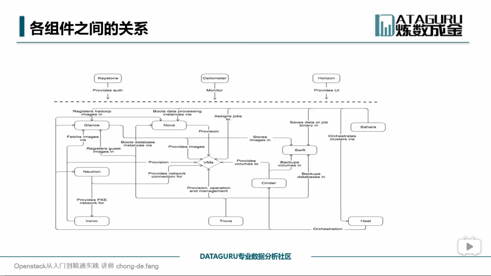
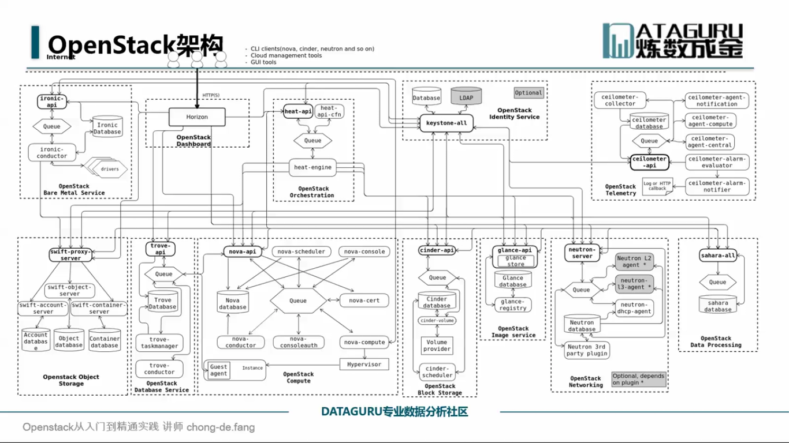

## 一、OpenStack项目介绍

#### 1、三种业务模式

- IaaS：基础设施即服务
- PaaS：平台即服务，虚拟主机，新浪SAE，google-GAE
- SaaS：软件即服务，基础设施，中间件（邮件系统）

#### 2、什么是

- 亚马逊云计算，山寨版本；
- 开源软件堆积出来的一个集合
- 公有云，私有云，混合云
- 集成框架，需要自己做开发

## 二、核心项目

- Nova：计算资源生命周期管理组件
- Neutron：提供云计算环境下的虚拟网络功能
- Cinder：管理计算实例所使用的块级存储(内存不够)
- Swift：对象存储，用于永久类型的静态数据的长期存储
- Glance：提供虚拟机镜像发现，注册，获取服务
- KeyStone：提供了用户信息管理，为其他组件提供认证服务
- Horizon：用以管理，控制OpenStack服务的Web控制面板

## 三、现状、发展前景

IAAS->PAAS

sahara-->openstack hadoop

一流企业定标准，二流企业做品牌，三流企业卖技术

## 四、架构和演进的趋势

1、特点

- 无中心
- 分布式
- 异步执行（消息队列）
- 插件化可配置
- RestfulAPI

2、设计优势

- 易扩展
- 部署灵活
- 易集成

## 五、应用实例

## 六、Docker,cloudStack

Openstack提供了一个完整管理数据中心的解决方案