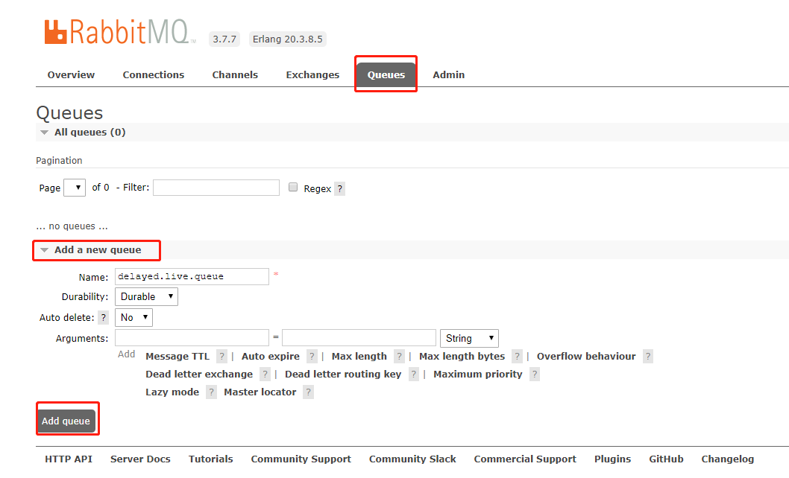
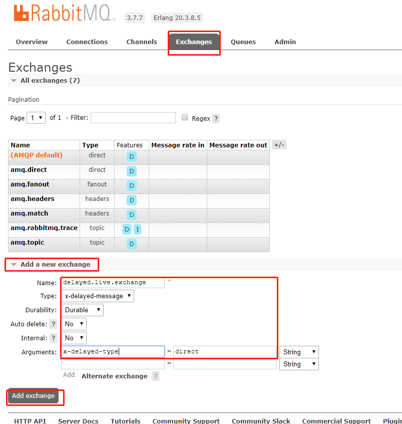
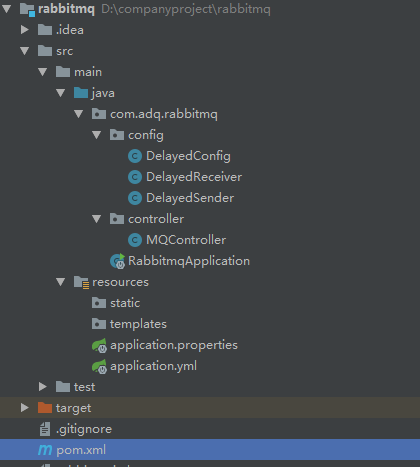
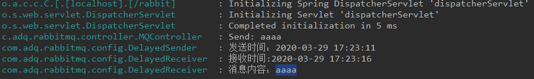

## SpringBoot+RabbitMQ延迟队列实现

### 一、rabbitMQ

> 实现通过Docker实现

#### 1、拉取镜像

```shell
# 下载有Web界面的容器
docker pull rabbitmq:3.7.7-management
```

#### 2、下载延迟插件

```shell

#在插件网址找到延迟插件的下载地址 http://www.rabbitmq.com/community-plugins.html 
#下载插件: 
wget  https://dl.bintray.com/rabbitmq/community-plugins/3.7.x/rabbitmq_delayed_message_exchange/rabbitmq_delayed_message_exchange-20171201-3.7.x.zip
#解压
unzip XXX.zip -d . 
```

#### 3、启动容器、添加延迟插件

```shell
#-d 后台运行容器；
#--name 指定容器名；
#-p 指定服务运行的端口（5672：应用访问端口；15672：控制台Web端口号）；
#-v 映射目录或文件；
#--hostname  主机名（RabbitMQ的一个重要注意事项是它根据所谓的 “节点名称” 存储数据，默认为主机名）；
#-e 指定环境变量；（RABBITMQ_DEFAULT_VHOST：默认虚拟机名；RABBITMQ_DEFAULT_USER：默认的用户名；RABBITMQ_DEFAULT_PASS：默认用户名的密码）
docker run -d --name rabbit -p 5672:5672 -p 15672:15672  -e RABBITMQ_DEFAULT_USER=admin -e RABBITMQ_DEFAULT_PASS=admin 2888
#再次进入docker容器内: 进入docker容器内 
docker exec  -it rabbit  /bin/bash
#命令查看已安装插件
rabbitmq-plugins list
#拷贝至docker容器内
docker cp rabbitmq_delayed_message_exchange-20171201-3.7.x.ez rabbit:/plugins
#执行命令让插件生效: 启动延时插件
rabbitmq-plugins enable rabbitmq_delayed_message_exchange
#可以使用浏览器打开web管理端：http://Server-IP:15672
```

#### 4、Web配置队列和交换机信息

添加队列信息（）



添加交换机信息



### 二、SpringBoot

#### 1、结构



#### 2、pom.xml

```xml
<?xml version="1.0" encoding="UTF-8"?>
<project xmlns="http://maven.apache.org/POM/4.0.0" xmlns:xsi="http://www.w3.org/2001/XMLSchema-instance"
	xsi:schemaLocation="http://maven.apache.org/POM/4.0.0 https://maven.apache.org/xsd/maven-4.0.0.xsd">
	<modelVersion>4.0.0</modelVersion>
	<parent>
		<groupId>org.springframework.boot</groupId>
		<artifactId>spring-boot-starter-parent</artifactId>
		<version>2.2.1.RELEASE</version>
		<relativePath/> <!-- lookup parent from repository -->
	</parent>
	<groupId>com</groupId>
	<artifactId>rabbitmq</artifactId>
	<version>0.0.1-SNAPSHOT</version>
	<name>rabbitmq</name>
	<description>Demo project for Spring Boot</description>
	<properties>
		<java.version>1.8</java.version>
	</properties>
	<dependencies>
		<dependency>
			<groupId>org.springframework.boot</groupId>
			<artifactId>spring-boot-starter-amqp</artifactId>
		</dependency>
		<dependency>
			<groupId>org.springframework.boot</groupId>
			<artifactId>spring-boot-starter-web</artifactId>
		</dependency>
		<dependency>
			   <groupId>org.projectlombok</groupId>
			   <artifactId>lombok</artifactId>
			   <version>1.16.16</version>
		</dependency>
		<dependency>
			<groupId>io.springfox</groupId>
			<artifactId>springfox-swagger2</artifactId>
			<version>2.6.1</version>
		</dependency>
		<dependency>
			<groupId>org.springframework.boot</groupId>
			<artifactId>spring-boot-starter-test</artifactId>
			<scope>test</scope>
			<exclusions>
				<exclusion>
					<groupId>org.junit.vintage</groupId>
					<artifactId>junit-vintage-engine</artifactId>
				</exclusion>
			</exclusions>
		</dependency>
		<dependency>
			<groupId>org.springframework.amqp</groupId>
			<artifactId>spring-rabbit-test</artifactId>
			<scope>test</scope>
		</dependency>
	</dependencies>
	<build>
		<plugins>
			<plugin>
				<groupId>org.springframework.boot</groupId>
				<artifactId>spring-boot-maven-plugin</artifactId>
			</plugin>
		</plugins>
	</build>
</project>

```

#### 3、ConfigBean

```java
package com.adq.rabbitmq.config;

import org.springframework.amqp.core.*;
import org.springframework.context.annotation.Bean;
import org.springframework.context.annotation.Configuration;

import java.util.HashMap;
import java.util.Map;

@Configuration
public class DelayedConfig {
    final static String QUEUE_NAME = "delayed.live.queue";
    final static String EXCHANGE_NAME = "delayed.live.exchange";

    @Bean
    public Queue queue() {
        return new Queue(DelayedConfig.QUEUE_NAME, true);
    }

    // 配置默认的交换机
    @Bean
    CustomExchange customExchange() {
        Map<String, Object> args = new HashMap<>();
        args.put("x-delayed-type", "direct");
        //参数二为类型：必须是x-delayed-message
        return new CustomExchange(DelayedConfig.EXCHANGE_NAME, "x-delayed-message", true, false, args);

    }

    // 绑定队列到交换器 将队列和交换机绑定， 并设置
    @Bean
    Binding binding(Queue queue, CustomExchange exchange) {
        return BindingBuilder.bind(queue).to(exchange).with(DelayedConfig.QUEUE_NAME).noargs();
    }
}

```


#### 4、Sender

```java
package com.adq.rabbitmq.config;

import lombok.extern.slf4j.Slf4j;
import org.springframework.amqp.AmqpException;
import org.springframework.amqp.core.AmqpTemplate;
import org.springframework.amqp.core.Message;
import org.springframework.amqp.core.MessagePostProcessor;
import org.springframework.beans.factory.annotation.Autowired;
import org.springframework.stereotype.Component;

import java.text.SimpleDateFormat;
import java.util.Date;

@Slf4j
@Component
public class DelayedSender {
    @Autowired
    private AmqpTemplate rabbitTemplate;

    public void send(String msg,Integer delaySeconds) {
        SimpleDateFormat sf = new SimpleDateFormat("yyyy-MM-dd HH:mm:ss");
        log.info("发送时间：" + sf.format(new Date()));

        rabbitTemplate.convertAndSend(DelayedConfig.EXCHANGE_NAME, DelayedConfig.QUEUE_NAME, msg, new MessagePostProcessor() {
            @Override
            public Message postProcessMessage(Message message) throws AmqpException {
                message.getMessageProperties().setHeader("x-delay", delaySeconds * 1000);
                return message;
            }
        });
    }
}
```


#### 5、Reciver

```java
package com.adq.rabbitmq.config;

import lombok.extern.slf4j.Slf4j;
import org.springframework.amqp.rabbit.annotation.RabbitHandler;
import org.springframework.amqp.rabbit.annotation.RabbitListener;
import org.springframework.stereotype.Component;

import java.text.SimpleDateFormat;
import java.util.Date;

@Slf4j
@Component
@RabbitListener(queues = DelayedConfig.QUEUE_NAME)
public class DelayedReceiver {
    @RabbitHandler
    public void process(String msg) {
        SimpleDateFormat sdf = new SimpleDateFormat("yyyy-MM-dd HH:mm:ss");
        log.info("接收时间:" + sdf.format(new Date()));
        log.info("消息内容：" + msg);
    }
}

```

#### 6、Controller

```java
package com.adq.rabbitmq.controller;

import com.adq.rabbitmq.config.DelayedSender;
import io.swagger.annotations.Api;
import io.swagger.annotations.ApiOperation;
import lombok.extern.slf4j.Slf4j;
import org.springframework.beans.factory.annotation.Autowired;
import org.springframework.web.bind.annotation.*;

@Slf4j
@RequestMapping("swapi")
@RestController
@Api(value = "SwTimetableLogApi", description = "mq测试", tags = {"mq测试"})
public class MQController {

    @Autowired
    private DelayedSender sender;

    @ApiOperation(value = "延迟队列测试")
    @GetMapping("/mq/{message}/{delay}")
    public String messageWithMQ(@PathVariable(value = "message") String message,
                                @PathVariable(value = "delay") Integer delay) {
        log.info("Send: " + message);
        sender.send(message, delay);
        return "ok";
    }
}
```

#### 7、yml

```yaml
server:
  servlet:
    context-path: /rabbit
  port: 8080
spring:
  application:
    name: rabbitmq-provider
  rabbitmq:
    host: ip
    port: 5672
    username: admin
    password: admim

```

#### 8、传对象

传递对象只需要实现序列化接口即可，不然会报错

```java
SimpleMessageConverter only supports String, byte[] and Serializable payloads
```

### 三、效果

访问URL： http://localhost:8080/rabbit/swapi/mq/aaaa/5 

效果：

