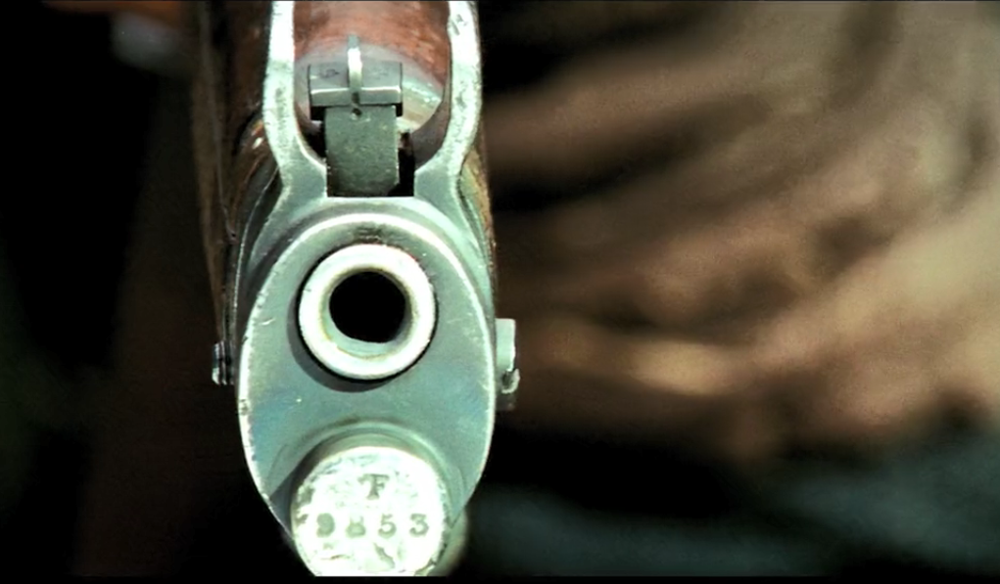
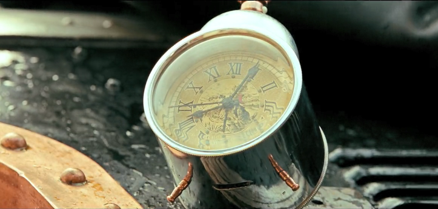
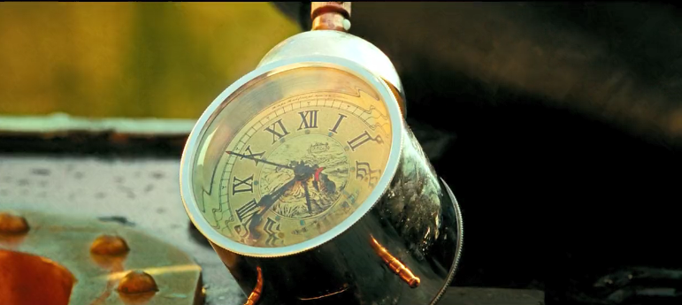
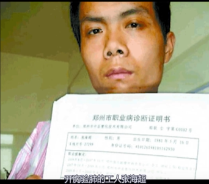
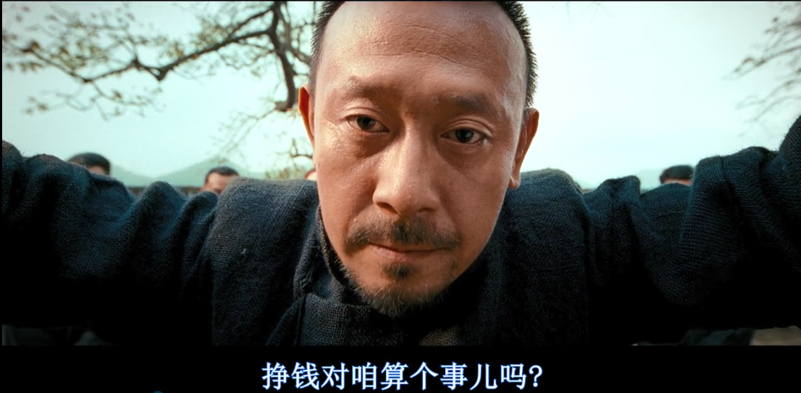

# 一、细节

### 1、枪口数字： 长征人数（中央军：9853）

### 2、什么TMD叫惊喜：什么叫联合舰队

1958年7月31日下午五时到晚九时

### 3、闹钟时间：8|1、77年？

### 4、结尾处：火车右转

### 5、你改主意啦？

### 6、鲁智冲

代表时代转变时期习武之人的运气流转，可以为虎作伥，也可以冲向碉楼

### 7、马拉列车败于腐

### 8、黛玉晴雯子

分列正册和又副册之首

# 二、背景

重要的不是影片拍摄的年代，而是拍摄影片的年代，而让子弹飞加了一个年代： 姜文要讲述的年代

### 1、小六子剖腹：开胸验肺的工人张海超

### 2、进城是打到老蒋之后的事情，浦东是改革春风吹满地的标志

### 3、小六子是谁：从镜头语言去寻找

演员不能直视镜头， 但是 让子弹飞 让演员直视镜头（斯坦尼斯拉夫，布莱希特的第四堵墙），说明正在看电影的是小六子，我们把张牧之当爷，张牧之把我们当儿， 一日为师终身为父

### 4、小六子破腹，为了张牧之的公平：日夏布

儿子救爸爸的故事

### 5、汤师爷： 写几个写剧本的老色鬼

旧时代的残党，新世界没有汤师爷的船。传统知识分子要么失语， 要么自残，侥幸生存的知识分子，也在新生代知识分子制作的技术思维型的浅薄中明哲保身。区别： 有没思想文化，有学问没思想，有知识没文化，起码马邦德都知道关着灯。

### 6、改编

四川怪才马识途老先生：夜谭十记-盗官记。原作 县长 王作宾改为马邦德。论语：邦有得则知邦无得则愚；

# 三、剧情

### 1、开头

紧张感（镜头不断切换）和荒诞感（马邦德和汤师爷的对话， 马拉列车，刘邦和项羽的讨论——刘邦是个小人）

汤师爷指导了张牧之革命的策略

### 2、六子敲冤鼓

没有声响不是没有不公，没有声响是因为没有渠道

### 3、站起来，不准跪

忽略了百姓长跪不起的习惯，要让武智冲跪下时，麻子和师爷说：还是枪好使，但是要让百姓们站起来怎么也要用枪来逼迫呢。要让跪就了的人民群众自发的站起来，要比让一度站着的人民自发跪下去更难

### 4、地下室戏

表露角色内心的想法

### 5、她真的是寡妇吗？

张牧之已经隐约怀疑起了马邦德的身份

### 6、你不要成为小凤仙哦

小凤仙是一代名妓，也有和蔡锷将军的感情

### 7、六爷之死

张牧之断案是断给前文提到的，麻木守旧的鹅城青壮年们看的，而黄四郎断案拉拢地方好深，邀请乡里权贵；前者是自下而上的心智激励，后者是自上而下的权力巩固。

卖凉粉的孙守义：没喊过青天大老爷，而武举人教训孙守义较好的和喊青天大老爷的人都是成群结队的，米兰昆德拉：他们只有在安全的时候才是勇敢的。县长为他声张正义时，他眼中都是不解和惶恐；县长声张正义也不是对他的同情，而是在树立权威的顺便帮他出口气罢了，但是这个同情过于慷慨，有些粗暴。

> 强者不得好死，弱者不得好活

对于弱者而言，正义对他们而言是过于奢侈的礼物。

越弱小的人，越身不由己。弱者的生存福祉，自由与公平的底线应该是衡量文明的一种标准

世界上唯一比证明自己做过好事更难的，是证明自己没做过某种坏事。污名化的攻击之所以难处理，是因为群众旺旺擅长怀疑。这种怀疑的本能和无罪推定的理性对冲，而哪怕一星半点低成本的伪证，都能打破疑罪从无的保护

六爷之死象征：

正直青年的惨死-生理层面的年轻，物理层面的正义，是那些在纷乱年代里抛头颅洒热血，甚至被恶人诬陷致死的青年才俊，是承载着更美好未来却没能摆脱旧恶势力魔爪的雏鹰

鲜活灵魂的陨落-包括黄四郎在内的所有看客们，在年轻时也有明辨黑白，嫉恶如仇的岁月，都经历过讲茶大堂暗箭中伤，但他们没有六子的鲁莽和勇气，他们也许蒙冤沉默，也许弃明投暗。围观看戏，比除在中央自证清白轻松得多。

真相对他们不重要，重要的是权力和安全。在那个年代，所有年轻人都愿意为正义献身，后来没死得人年轻替他们抵了命。我为精致的利己主义者越来越多感到害怕，我为我也能理解这种苟且感到害怕，我为假设自己就是六子但没办法自证证清白，却也不敢赴死感到害怕，我为自己的思想与看客们暗合感到害怕。

十年前，我们以为自己长大会变成六子会刚正不阿，会嫉恶如仇，但十年后的我们少的是血气方刚，多得是苦涩一下。

### 8、鸿门宴

1、项羽刘邦：体现领导人一体两面

2、去会会你的新朋友

3、花有重开日人无再少年：宋朝诗人陈著。相逢半酩酊何必备芳鲜。

4、师爷：easy

一般组织别人暴怒relax， 嫌疑犯举枪和警方对峙这种生死时刻才用的表达

9、