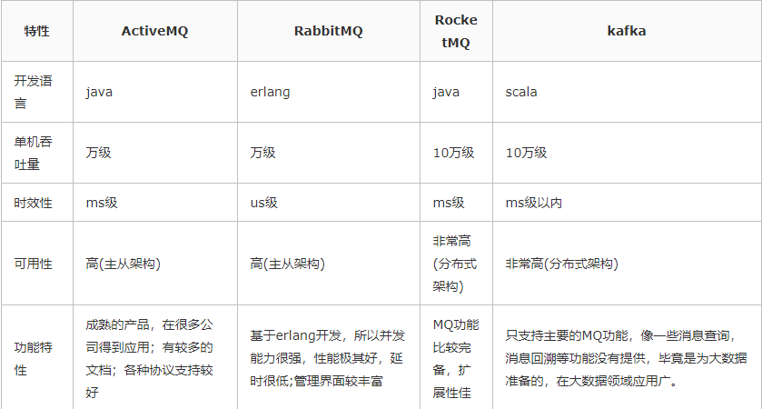
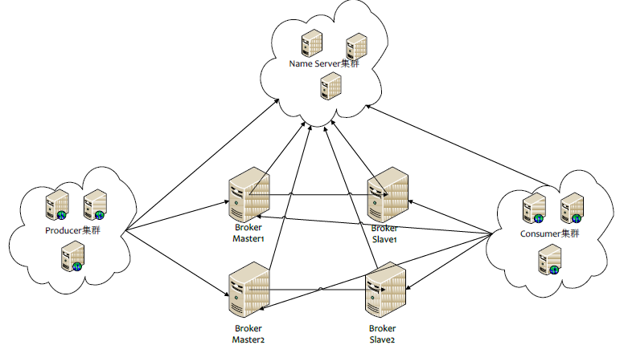
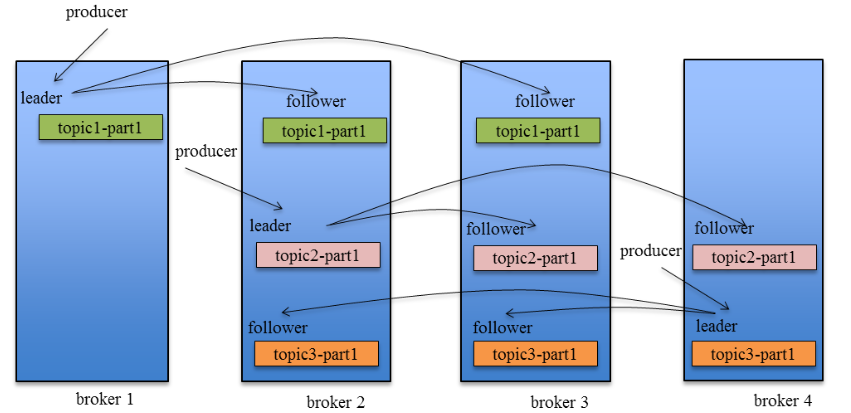

# 消息队列

### 一、为什么使用

#### 1、解耦

把消费者从提供者中剥离

#### 2、异步

将消息写入消息队列， 非必要的业务逻辑以异步的方式运行，加快响应速度

#### 3、削峰

减少并发量大时 直接怼到数据库的问题

### 二、有什么缺点

#### 1、系统可用性降低

多了组件，系统异常情况增加

#### 2、系统复杂性增加

要考虑多方面的问题， 比如一致性问题、如何保证不被重复消费，如何保证数据可靠传输

### 三、如何进行选型

#### 1、更新频率

ActiveMQ几个月更新一次，RabbitMQ更新频率较快

#### 2、简单总结

1、小公司建议使用RabbitMQ

erlang语言天生具备高并发的特性，而且管理界面比较方便；但是ErLang语言比较小众；

不考虑Kafka，中小型公司，数据量没那么大，首选功能比较完备的

不考虑RocketMQ，是阿里定制， 如果阿里放弃维护，不能抽取人定制开发

2、大公司，根据具体选择Kafka/RocketMQ 二选一

大公司，有足够的资金搭建分布式环境，也具备足够大的数据量，针对Rocket也有可以进行定制化开发。如果有日志采集功能，首选kafka

### 四、如何保证高可用

#### 1、Rocket集群模式

集群有 多master模式，多master多slave异步复制模式，多master多slave同步双鞋模式

  

#### 2、RocketMQ通信流程

 Producer 与 NameServer集群中的其中一个节点（随机选择）建立长连接，定期从 NameServer 获取 Topic 路由信息，并向提供 Topic 服务的 Broker Master 建立长连接，且定时向 Broker 发送心跳。Producer 只能将消息发送到 Broker master，但是 Consumer 则不一样，它同时和提供 Topic 服务的 Master 和 Slave建立长连接，既可以从 Broker Master 订阅消息，也可以从 Broker Slave 订阅消息。 

#### 3、Kafka拓扑架构图

#### 4、Kafka集群流程

每个Kafka集群都包含 若干Producer（Web端的PageView，服务器日志，系统CPU，Memory等）、若干broker（kafka支持水平扩展，一般broker数量越多，集群吞吐率越高）若干consumer group ，以及一个zookeeper集群。kafka通过zookeeper进行进群管理， 选举leader，以及在consumer group 发生变化时进行reblance。

#### 5、RabbitMQ集群

普通集群和镜像集群模式

### 五、如何保证不重复消费

#### 1、为什么会造成重复消费

正常情况下：消费者消费完成， 会发送一个确认消息给消息队列， 消息队列就知道该消息被消费了，就将该消息从消息队列中删除。

不同的消息队列确认消息形式不同：

RabbitMQ 会发送一个ACK确认消息

RocketMQ 会返回一个CONSUME_SUCCESS成功标志

Kafka：每个消息都有一个offset， kafka消费过消息后，需要提交offset， 让消息队列知道自己已经消费过了。

#### 2、重复消费

由于网络传输故障，确认消息没有传输到消息队列，导致消息队列不知道已经消费过改消息， 再次将消息发送给其他消费者。

#### 3、如何解决

a、比如，你拿到这个消息做数据库的insert操作， 那么久给这个消息做一个唯一主键，那么重复消息，就会导致主键冲突，避免数据库出现脏数据。

b、比如，你拿到这个消息做redis的set的操作，那么容易了， 不用解决，因为不管set多次结果都是一样的，set本身就是幂等操作

c、准备第三方截止，做消费记录，以redis为例，给消息分配一个全局ID，只要消费过该消息，就以k-v形式写入redis。消费者开始消费钱，先去redis中查询有没消费记录即可

### 六、如何保证可靠传输

生产者弄丢数据，消息队列弄丢数据，消费者弄丢数据

#### RabbitMQ

##### 1、生产者：提供transaction和confirm模式来确保生产者不丢失数据

transaction模式： 事务，当发送消息前，开启事务（channel.txSelect()）,然后发送消息，如果没出现过程中出现什么异常，事务就会回滚（channel.txRollback()）.发送成功则提交事务（channel.txcommint()）;缺点就是 吞吐量下降了

confirm模式：所有在该信道上消息将指派唯一的ID，一旦下次投递到所匹配的队列之后， rabbitmq就会发送一个ack给生产者，这就使得生产者知道消息以正确到达队列。如果队列没能处理该消息，就会发送一条NACK给你，可以进行重试操作

##### 2、消息队列丢失数据

一般开启持久化磁盘的配置。可以配置confirm机制使用，在消息持久化磁盘后，再给生产者发送一个ack信号。

1、queue的持久化标识durable 设置为true，则代表死一个持久队列

2、发送消息的时候将deliveryMode=2

##### 3、消费者丢失数据

消费者一般使用自动确认机制。如果消费者确认收到消息，这时rabbitmq会立即删除消息。

#### Kafka

流程：

Producer发送消息时， 先通过Zookeeper找到该partition的leader， 然后无论该topic的replication factor为多少，producer智慧将消息发送该partition的leader，leader会将消息写入Log,每个follower 都从leader 中pull 数据

##### 1、生产者

kafka 生产中， 基本上都是 一个leader和多个follower， follower会去同步leader的信息。因此避免丢失

需要配置acks=all。保证follower同步完成后，才认为消息发送成功。

producer端设置retries=max 一旦写入失败，则无限重试

##### 2、消息队列

丢数据情况，就是，数据没同步leader就挂了，这是zookeeper将其他的follower切换为leader，那么数据就丢失了。需要设置

replication.factor参数>1 每个partition至少有两个副本

min.insync.replicas，这个值必须大于1，这是要求一个leader 至少感知到有一个follower还和自己保持联系

##### 3、消费者

自动提交offset 改为手动提交

### 七、如何保证消息顺序性