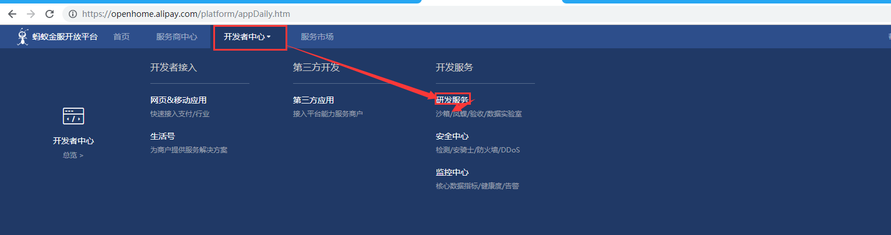

## 支付宝支付

### 一、概念解读

#### 1、与微信支付的区别

a、与微信支付不同，支付宝支付有沙箱环境（开发环境）

```xml
https://auth.alipay.com/login/ant_sso_index.htm?goto=https%3A%2F%2Fopenhome.alipay.com%2Fplatform%2FappDaily.htm
```

b、由于没有像微信一样方便交互的APP，支付宝支付在发起支付后，会返回html字符串（见下代码），将字符串拼接之后会有自动跳转页面。

```html
<form name="punchout_form" method="post" action="n="https://openapi.alipaydev.com/gateway.do?charset=utf-8&method=alipay.trade.…=20…=2018-10-12+11%3A11%3A07&alipay_sdk=dk=alipay-sdk-java-3.3.49.ALL&for&format=json">
<input type="hidden" name="biz_content" value="{&quot;out_trade_no&quot;:&quot;2018101211110738800724696223&quot;,&quot;product_code&quot;:&quot;QUICK_WAP_WAY&quot;,&quot;subject&quot;:&quot;活动报名费&quot;,&quot;timeout_express&quot;:&quot;2m&quot;,&quot;total_amount&quot;:&quot;0.01&quot;}">
<input type="submit" value="立即支付" style="display:none" >
</form>
```

### 二、流程介绍

> 参考官方文档的配置https://docs.open.alipay.com/200/105311/

#### 1、登陆支付宝进入沙箱界面



#### 2、设置密钥数据

>  生成密钥查看：https://docs.open.alipay.com/291/105971，注意应用的公钥可以修改，支付宝的公钥不需要修改，支付宝自动生成。

#### 3、获取个人信息

#### 4、注意网关地址

### 三、代码实现

#### 1、搭建环境，引入jar包

#### 2、环境静态变量获取

#### 3、实体类设置

#### 4、请求方法实现


