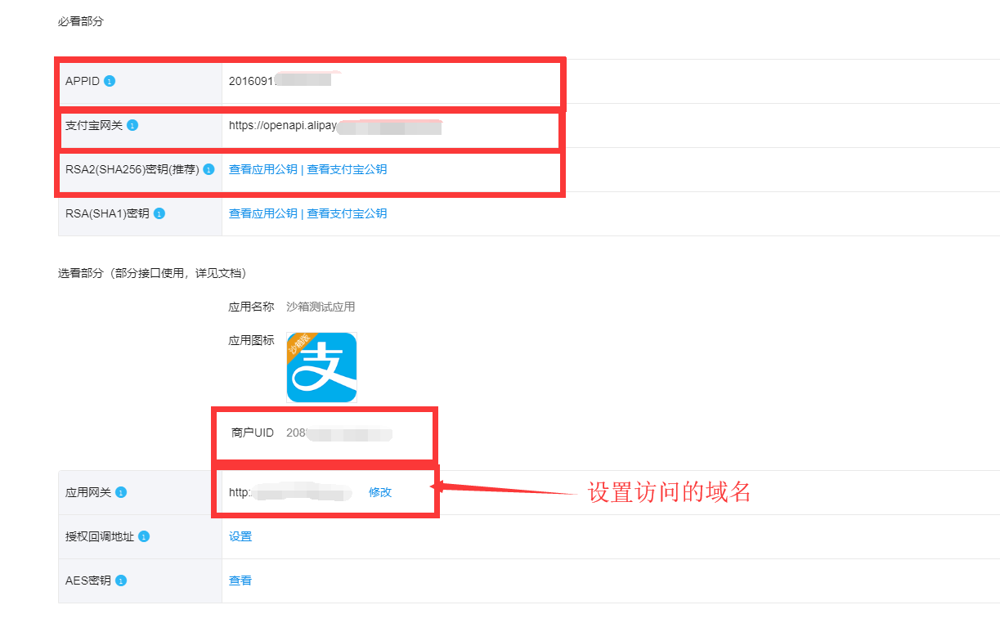
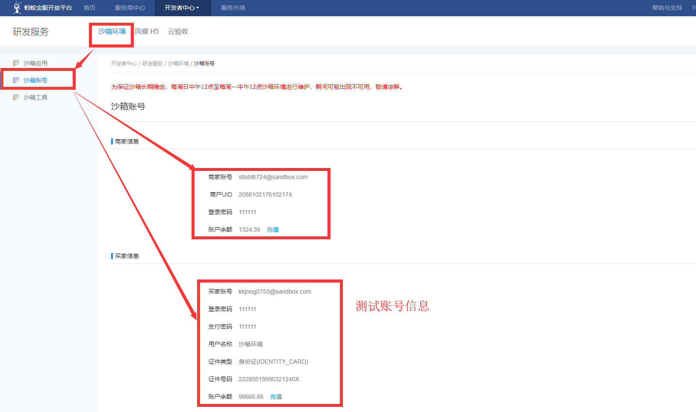

## 支付宝支付

### 一、概念解读

#### 1、与微信支付的区别

a、与微信支付不同，支付宝支付有沙箱环境（开发环境）

```xml
https://auth.alipay.com/login/ant_sso_index.htm?goto=https%3A%2F%2Fopenhome.alipay.com%2Fplatform%2FappDaily.htm
```

b、由于没有像微信一样方便交互的APP，支付宝支付在发起支付后，会返回html字符串（见下代码），将字符串拼接之后会有自动跳转页面。

```html
<form name="punchout_form" method="post" action="n="https://openapi.alipaydev.com/gateway.do?charset=utf-8&method=alipay.trade.…=20…=2018-10-12+11%3A11%3A07&alipay_sdk=dk=alipay-sdk-java-3.3.49.ALL&for&format=json">
<input type="hidden" name="biz_content" value="{&quot;out_trade_no&quot;:&quot;2018101211110738800724696223&quot;,&quot;product_code&quot;:&quot;QUICK_WAP_WAY&quot;,&quot;subject&quot;:&quot;活动报名费&quot;,&quot;timeout_express&quot;:&quot;2m&quot;,&quot;total_amount&quot;:&quot;0.01&quot;}">
<input type="submit" value="立即支付" style="display:none" >
</form>
```

### 二、流程介绍

> 参考官方文档的配置https://docs.open.alipay.com/200/105311/

#### 1、登陆支付宝进入沙箱界面


#### 2、设置密钥数据

>  生成密钥查看：https://docs.open.alipay.com/291/105971，注意应用的公钥可以修改，支付宝的公钥不需要修改，支付宝自动生成。

#### 3、获取个人信息

从沙箱界面获取app_id,mch_id,ALIPAY_PUBLIC_KEY,APP_PRIVATE_KEY（设置密钥信息时生成的私钥）



#### 4、注意网关地址

沙箱测试环境的网关地址是：https://openapi.alipaydev.com/gateway.do，正式环境的网关地址是另外一个

#### 5、测试账号信息

测试账号只支持在测试环境下使用



### 三、代码实现

#### 1、搭建环境，引入jar包

项目使用springboot实现，所以代码比较简单

```xml
<dependency>
    <groupId>com.alipay.sdk</groupId>
    <artifactId>alipay-sdk-java</artifactId>
    <version>3.3.49.ALL</version>
</dependency>
<dependency>
    <groupId>com.alibaba</groupId>
    <artifactId>fastjson</artifactId>
    <version>1.2.24</version>
</dependency>
```

#### 2、环境静态变量获取

```java
@Component
public class AlipayConstants {
    public static String HOST_URL;
    
    public static final String SIGN_TYPE = "sign_type";
    public static final String SIGN_TYPE_RSA = "RSA";
    public static final String SIGN_TYPE_RSA2 = "RSA2";
    public static final String SIGN_ALGORITHMS = "SHA1WithRSA";
    public static final String SIGN_SHA256RSA_ALGORITHMS = "SHA256WithRSA";
    public static final String ENCRYPT_TYPE_AES = "AES";
    public static final String FORMAT = "format";
    public static final String METHOD = "method";
    public static final String TIMESTAMP = "timestamp";
    public static final String VERSION = "version";
    public static final String SIGN = "sign";
    public static final String ALIPAY_SDK = "alipay_sdk";
    public static final String ACCESS_TOKEN = "auth_token";
    public static final String APP_AUTH_TOKEN = "app_auth_token";
    public static final String TERMINAL_TYPE = "terminal_type";
    public static final String TERMINAL_INFO = "terminal_info";
    public static final String CHARSET = "utf-8";
    public static final String NOTIFY_URL = HOST_URL + "/notifyAlipayURL";
    public static final String RETURN_URL = HOST_URL + "/notifyAlipayURL";
    public static final String ENCRYPT_TYPE = "encrypt_type";
    public static final String BIZ_CONTENT_KEY = "biz_content";
    public static final String DATE_TIME_FORMAT = "yyyy-MM-dd HH:mm:ss";
    public static final String DATE_TIMEZONE = "GMT+8";
    public static final String CHARSET_UTF8 = "UTF-8";
    public static final String CHARSET_GBK = "GBK";
    public static final String FORMAT_JSON = "json";
    public static final String FORMAT_XML = "xml";
    public static final String SDK_VERSION = "alipay-sdk-java-3.3.49.ALL";
    public static final String PROD_CODE = "prod_code";
    public static final String ERROR_RESPONSE = "error_response";
    public static final String RESPONSE_SUFFIX = "_response";
    public static final String RESPONSE_XML_ENCRYPT_NODE_NAME = "response_encrypted";

    /**
     * 应用私钥
     */
    public static final String APP_PRIVATE_KEY = "MIIEvgIBADANBgkqhkiXXX";
    /**
     * 支付宝公钥
     */
    public static final String ALIPAY_PUBLIC_KEY = "MIIBIjANBgkqXXX";
    /**
     * 商铺ID
     */
    public static final String MTH_ID = "20881XXX";
    /**
     * 应用ID
     */
    public static final String APP_ID = "201609XXX";
    public static final String PRODUCT_CODE = "QUICK_WAP_WAY";


    public String getHostUrl() {
        return HOST_URL;
    }

    @Value("${alipay.host_url}")
    public void setHostUrl(String hostUrl) {
        HOST_URL = hostUrl;
    }
}
```

#### 3、实体类设置

```java
public class AlipayNotifyParam {
    private String appId;
    private String tradeNo; // 支付宝交易凭证号
    private String outTradeNo; // 原支付请求的商户订单号
    private String outBizNo; // 商户业务ID，主要是退款通知中返回退款申请的流水号
    private String buyerId; // 买家支付宝账号对应的支付宝唯一用户号。以2088开头的纯16位数字
    private String buyerLogonId; // 买家支付宝账号
    private String sellerId; // 卖家支付宝用户号
    private String sellerEmail; // 卖家支付宝账号
    private String tradeStatus; // 交易目前所处的状态，见交易状态说明
    private BigDecimal totalAmount; // 本次交易支付的订单金额
    private BigDecimal receiptAmount; // 商家在交易中实际收到的款项
    private BigDecimal buyerPayAmount; // 用户在交易中支付的金额
    private BigDecimal refundFee; // 退款通知中，返回总退款金额，单位为元，支持两位小数
    private String subject; // 商品的标题/交易标题/订单标题/订单关键字等
    private String body; // 该订单的备注、描述、明细等。对应请求时的body参数，原样通知回来
    private Date gmtCreate; // 该笔交易创建的时间。格式为yyyy-MM-dd HH:mm:ss
    private Date gmtPayment; // 该笔交易的买家付款时间。格式为yyyy-MM-dd HH:mm:ss
    private Date gmtRefund; // 该笔交易的退款时间。格式为yyyy-MM-dd HH:mm:ss.S
    private Date gmtClose; // 该笔交易结束时间。格式为yyyy-MM-dd HH:mm:ss
    private String fundBillList; // 支付成功的各个渠道金额信息,array
    private String passbackParams; // 公共回传参数，如果请求时传递了该参数，则返回给商户时会在异步通知时将该参数原样返回。
    
    //省略getter和setter方法
}
```

#### 4、请求方法实现

```java
@RestController
public class AlipayController {
    @RequestMapping("/alipay")
    public void payInit(HttpServletResponse response) throws AlipayApiException, IOException {
        System.out.println(HOST_URL);
        //实例化客户端
        AlipayClient alipayClient = new DefaultAlipayClient(
                "https://openapi.alipaydev.com/gateway.do",
                APP_ID,
                APP_PRIVATE_KEY,
                "json",
                CHARSET,
                ALIPAY_PUBLIC_KEY,
                "RSA2");
        //SDK已经封装掉了公共参数，这里只需要传入业务参数
        //此次只是参数展示，未进行字符串转义，实际情况下请转义
        AlipayTradeWapPayRequest alipay_request=new AlipayTradeWapPayRequest();

        // 超时时间 可空
        String timeout_express="2m";
        // 销售产品码 必填
        String product_code="QUICK_WAP_WAY";

        // 封装请求支付信息
        AlipayTradeWapPayModel model=new AlipayTradeWapPayModel();
        String id = UUID.randomUUID().toString().replace("-", "");
        model.setOutTradeNo(id);
        model.setSubject("活动报名费");
        model.setTotalAmount("88");
        //model.setBody(body);
        model.setTimeoutExpress(timeout_express);
        model.setProductCode(PRODUCT_CODE);
        alipay_request.setBizModel(model);
        // 设置异步通知地址
        alipay_request.setNotifyUrl(NOTIFY_URL);
        // 设置同步地址
        //alipay_request.setReturnUrl(RETURN_URL);
        String  form = alipayClient.pageExecute(alipay_request).getBody();

        response.setContentType("text/html;charset=" + CHARSET_UTF8);
        response.getWriter().write(form);//直接将完整的表单html输出到页面
        response.getWriter().flush();
        response.getWriter().close();
    }

    @RequestMapping("/notifyAlipayURL")
    public void notifyAlipayURL(HttpServletRequest request) throws AlipayApiException {
        Map<String, String> params = convertRequestParamsToMap(request); // 将异步通知中收到的待验证所有参数都存放到map中
        String paramsJson = JSON.toJSONString(params);
        String payID = params.get("out_trade_no");
        boolean flag = AlipaySignature.rsaCheckV1(params, ALIPAY_PUBLIC_KEY, CHARSET, params.get("sign_type"));
        System.out.println(flag);
    }

    // 将request中的参数转换成Map
    private static Map<String, String> convertRequestParamsToMap(HttpServletRequest request) {
        Map<String, String> retMap = new HashMap<String, String>();

        Set<Map.Entry<String, String[]>> entrySet = request.getParameterMap().entrySet();

        for (Map.Entry<String, String[]> entry : entrySet) {
            String name = entry.getKey();
            String[] values = entry.getValue();
            int valLen = values.length;

            if (valLen == 1) {
                retMap.put(name, values[0]);
            } else if (valLen > 1) {
                StringBuilder sb = new StringBuilder();
                for (String val : values) {
                    sb.append(",").append(val);
                }
                retMap.put(name, sb.toString().substring(1));
            } else {
                retMap.put(name, "");
            }
        }

        return retMap;
    }

}
```


